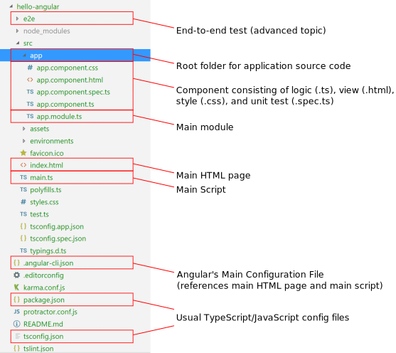
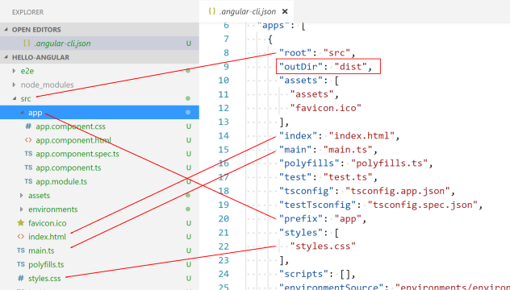
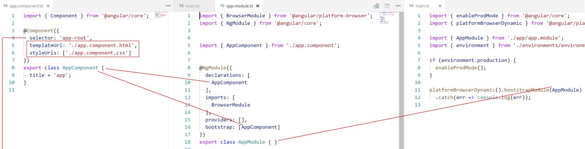

# Angular

Introduction to [Angular](https://angular.io/)


<!-- .slide: class="left" -->
## What is *Angular*?

* Platform for building client applications with web technology
  * HTML, JavaScript/TypeScript, CSS/SASS
* Angular covers ([read more details](https://angular.io/guide/architecture)):
  * Modules
  * Components (=application logic)
  * Templates (=view)
  * Data Binding (*Components* to *Templates*)
  * Services
  * Dependency Injection


<!-- .slide: class="left" -->
## Getting Started

* [Angular CLI](https://cli.angular.io/)

```
npm install -g @angular/cli
ng help
ng new my-first-project
cd my-first-project
ng serve
```


<!-- .slide: class="left" -->
## Getting Started

* [StackBlitz](https://stackblitz.com/)
* Online *Visual Studio Code* IDE for Angular (and React)
* [Read details...](https://medium.com/@ericsimons/stackblitz-online-vs-code-ide-for-angular-react-7d09348497f4)


<!-- .slide: class="left" -->
## Project Structure




<!-- .slide: class="left" -->
## Project Structure




<!-- .slide: class="left" -->
## Project Structure




<!-- .slide: class="left" -->
## Template & Data Binding

| Syntax                       | Description
|------------------------------|----------------------------------------------------------
| `{{title}}`                  | One-way binding from data source to view ([interpolation](https://angular.io/guide/template-syntax#interpolation----))
| `{{1 + 1}}`                  | One-way binding with [template expression](https://angular.io/guide/template-syntax#template-expressions)
| `[hidden]="!isValid()"`      | One-way data binding to property ([property binding](https://angular.io/guide/template-syntax#property-binding--property-))

* [Avoid side-effects](https://angular.io/guide/template-syntax#avoid-side-effects)!


<!-- .slide: class="left" -->
## Template & Data Binding

| Syntax                            | Description
|-----------------------------------|----------------------------------------------------------
| `(click)="onSave()"`              | One-way event binding from element to component ([event binding](https://angular.io/guide/template-syntax#event-binding---event-))
| `<input [(ngModel)]="firstName">` | Two-way binding ([*ngModel*](https://angular.io/guide/template-syntax#ngModel))


<!-- .slide: class="left" -->
## Template & Data Binding

* Define HTML *layout* and *structure*
* Prefixed with `*`

| Syntax                       | Description
|------------------------------|----------------------------------------------------------
| `*ngFor="let i of items"`    | Repeater directive ([*ngForOf*](https://angular.io/guide/template-syntax#ngforof))
| `*ngIf="len > 3"`            | Conditional display ([*ngIf*](https://angular.io/guide/template-syntax#ngif))
| `ngSwitch`/`*ngSwitchCase`   | Conditional display ([example](https://angular.io/guide/template-syntax#ngSwitch))


<!-- .slide: class="left" -->
## Template & Data Binding

| Syntax                       | Description
|------------------------------|----------------------------------------------------------
| `[class]="errorClass"`       | Replacement [class binding](https://angular.io/guide/template-syntax#class-binding)
| `[class.error]="hasError()"` | Toggling [class binding](https://angular.io/guide/template-syntax#class-binding)
| `[style.color]="hasError() ? 'red' : 'green'"` | [Style binding](https://angular.io/guide/template-syntax#style-binding)


<!-- .slide: class="left" -->
## Template & Data Binding

| Syntax                                     | Description
|--------------------------------------------|----------------------------------------------------------
| `{{ birthday ` &#124; ` date:'longDate'}}` | [Pipe](https://angular.io/guide/template-syntax#the-pipe-operator---) operator

* [Built-in pipes](https://angular.io/guide/pipes#built-in-pipes)
* Advanced topic: Building [custom pipes](https://angular.io/guide/pipes#custom-pipes)


<!-- .slide: class="left" -->
## Advanced Template & Data Binding

* [HTML attributes vs. DOM properties](https://angular.io/guide/template-syntax#html-attribute-vs-dom-property)
* [Template reference variables](https://angular.io/guide/template-syntax#template-reference-variables--var-)
* [*Input* and *Output* properties](https://angular.io/guide/template-syntax#input-and-output-properties)


<!-- .slide: class="left" -->
## Further Readings and Exercises

* Want to know more? Read/watch...
  * [Angular Documentation](https://angular.io/docs)
  * [Angular Tutorial](https://angular.io/tutorial)
  * [Angular Cheat Sheet](https://angular.io/guide/cheatsheet)
* Exercises
