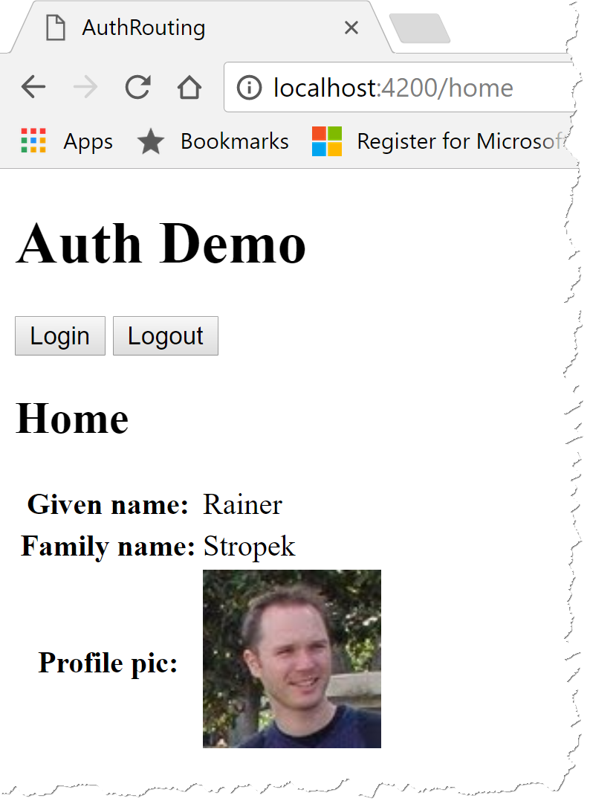

# Angular with Login Quiz

## Introduction

You job is to create an Angular application that allows users to login and logout using a social media account (e.g. Google Account, Microsoft Account). The app has to include content that is only visible if the user has successfully logged in.

## Step by Step Guide

* Create a new Angular application using the *Angular CLI*. The new app has to include a [*client-side router*](https://angular.io/guide/router).

* Get a **free** account from [auth0](https://auth0.com/)

* [Create a client](https://auth0.com/docs/clients#how-to-configure-a-client) in auth0. Configure it to be a *Single Page Web App*.
  * Register `http://localhost:4200/callback` as the *callback URL* for your app

* [Enable Google and Microsoft Accounts](https://auth0.com/docs/identityproviders) for your client app.

* Follow the *Angular 2+* guide in [auth0's documentation](https://auth0.com/docs/quickstart/spa/angular2) to add an authentication service `AuthService` to your Angular app. Do **not** just download auth0's sample app.

* Don't forget to add your `AuthService` to your `AppModule` as follows:

```ts
@NgModule({
  declarations: [ ... ],
  imports: [ ... ],
  providers: [AuthService],
  bootstrap: [AppComponent]
})
export class AppModule { }
```

* Follow the rest of the *Angular 2+* guide in [auth0's documentation](https://auth0.com/docs/quickstart/spa/angular2) to...
  * ...add a *login* and a *logout* button,
  * ...the *callback* route,
  * ...and the processing of the authentication result.

* Here is an example for an app component with login/logout buttons and the processing of the authentication result:

```ts
@Component({
  selector: 'app-root',
  template: `
    <h1>Auth Demo</h1>

    <button (click)="auth.login()">Login</button>
    <button (click)="auth.logout()">Logout</button>

    <router-outlet></router-outlet>
  `,
  styles: []
})
export class AppComponent {
  constructor(public auth: AuthService) {
    auth.handleAuthentication();
  }
}
```

* Follow the *Angular 2+* guide in [auth0's documentation](https://auth0.com/docs/quickstart/spa/angular2/02-user-profile) to get the user's profile information and display it in your Angular app:



## Advanced Exercise

Do you want to go one step further? Here is an idea:

* [Create a Node.js Web API protected by auth0](https://auth0.com/docs/quickstart/backend/nodejs)

* [Call the Web API with an access token](https://auth0.com/docs/quickstart/spa/angular2/03-calling-an-api).

## Sample Solution

You can find a sample solution (without the advanced exercise) in [auth-routing](auth-routing). Try to solve the quiz yourself and use the sample solution only to overcome problems.
