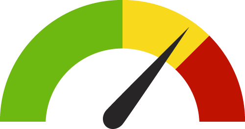

# Angular Dashboard Quiz

## Introduction

Your job is to create an Angular component that can display line charts.

## Technical Specification

* You have to create a reusable component that can be embedded in Angular wherever a line chart is needed. The code to include the line chart could look like this: `<app-line-chart [data]="myDataSource">`.

* The input for the line chart (`data` in the example above) is a collection of numbers (see also test data below) that contains between 2 and 50 elements.

* The generated line chart can have a fixed width and height (e.g. 500px in height and 800px in width).

* The line chart has to have a X and Y axis drawn in black.
  * The Y axis has to have grid lines with values as shown in the following example. Assuming a fixed number of grid line (e.g. 10) on the Y axis is ok.
  * You have to calculate the maximum value for the Y axis based on the input data. The minimum value on the Y axis is always 0.
  * The X axis has to have tick marks as shown in the following example.


## Technical Tips

* A component can receive input data using the `@Input` decorator ([read more](https://angular.io/guide/component-interaction))

* Draw lines in SVG using `line` ([read more](https://developer.mozilla.org/en-US/docs/Web/SVG/Element/line))

* Draw polylines in SVG using `polyline` ([read more](https://developer.mozilla.org/en-US/docs/Web/SVG/Element/polyline))

* Draw text in SVG using `text` ([read more](https://developer.mozilla.org/en-US/docs/Web/SVG/Element/text))

* If you want to use data binding for SVG attributes, you have to use Angular's [attribute bindings](https://angular.io/guide/template-syntax#attribute-binding).

## Test Data

Use the following test data to generate a line chart:

```js
[ 100, 91.86, 100.14, 101.23, 107.09, 113.70, 121.45, 122.71, 
125.09, 119.75, 123.65, 121.90, 113.49, 121.18, 112.96, 118.19, 
113.63, 115.61, 123.70, 121.42, 120.17, 118.65, 124.32, 124.60, 
116.53, 114.22, 109.33, 113.87, 115.41, 122.24 ]
```

## Advanced Exercises

Did you finish early? Here are some advanced exercises you could try:

* Create a separate [Angular module](https://angular.io/guide/architecture-modules) for the line chart component

* Create a second component for drawing bar charts

* Design and implement a third component for a *gauge*. Here is an example how it could look like:


