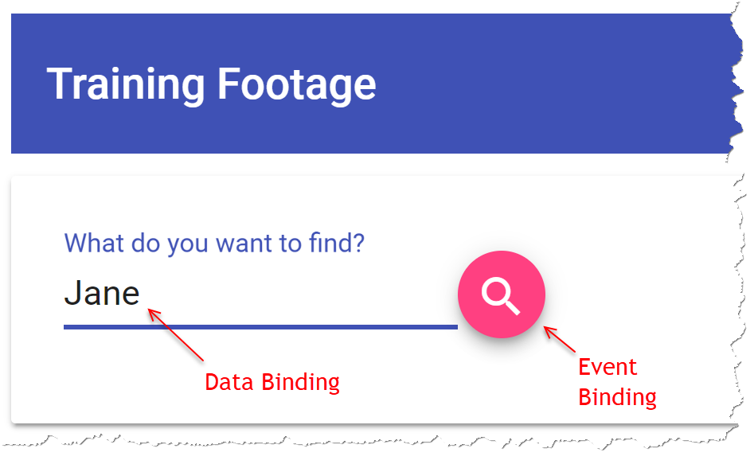
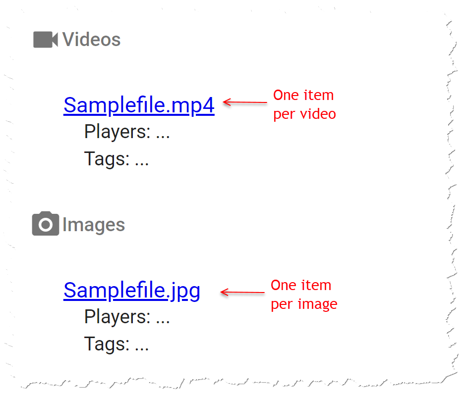

# Test Mobile Computing 17. Mai 2018

## Aufgabe 1 (10 Punkte)

### Einleitung

Ihre Aufgabe ist es, ein neues Angular-Projekt zu starten. In dieser Aufgabe sollen Sie zeigen, dass Sie...

* ...mit der *Angular CLI* umgehen,
* ...einen client-seitigen Router in Angular konfigurieren können und dass Sie...
* ...ein Angular-Projekt um externe Libraries und Frameworks erweitern können.

### Spezifikation

1. (2 Punkte) Erstellen Sie eine neue Angular-Anwendung namens *ng-exam*. Nutzen Sie dafür die *neustes Version der Angular CLI* (6.x). Die erstellte Angular-Anwendung muss insbesondere folgende Komponenten enthalten:
    1. Client-seitiger Router
    1. *Service Worker* Unterstützung

1. (3 Punkte) Fügen Sie der neuen Angular-Anwendung [*Bootstrap*](http://getbootstrap.com/) hinzu. Beachten Sie dabei folgende Anforderungen:
    1. Bootstrap muss in die Anwendung integriert werden, es soll kein CDN verwendet werden.
    1. Vergessen Sie nicht, dass Bootstrap *jQuery* benötigt. Sie müssen also diese JavaScript-Bibliothek *vor Bootstrap* zur Ihrer Anwendung hinzufügen.
    1. Fügen Sie sowohl den CSS- als auch den JavaScript-Teil von Bootstrap zu Ihrer Anwendung hinzu.
    1. Hinweis zum JavaScript-Teil: Binden Sie das *bootstrap.bundle.js*, nicht *bootstrap.js* ein.

1. (1 Punkt) Fügen Sie Ihrer Anwendung zwei Angular-Komponenten (Name beliebig wählbar, z.B. `PageOne` und `PageTwo`) mit Hilfe der *Angular CLI* hinzu. Sie müssen den von der CLI generierten Beispielcode nicht verändern.

1. (2 Punkte) Konfigurieren Sie den Router für folgende URLs:
    1. `/page-one` soll auf Ihre erste, im vorherigen Schritt erzeugte Komponente navigieren
    1. `/page-two` soll auf Ihre zweite, im vorherigen Schritt erzeugte Komponente navigieren
    1. `/` soll auf `/page-one` umleiten (*redirect*)

1. (2 Punkte) Fügen Sie Ihrer Anwendung ein Hauptmenü hinzu (keine speziellen Design-Anforderungen, einfache Hyperlinks mit dem `<a>`-Tag sind ausreichend), mit dessen Hilfe man zwischen den im vorigen Schritt definierten beiden Routen navigieren kann. Das Hauptmenü muss am Beginn jeder Seite enthalten sein.

## Aufgabe 2 (24 Punkte)

### Einleitung

Sie sind Mitglied in einem Basketballverein. Bei Trainings und Spielen werden oft Videos und Fotos aufgenommen. Ziel dieser Aufgabe ist die Entwicklung einer Angular App, mit der man nach Videos und Fotos suchen kann.

Ihre Aufgabe ist es, ein bestehendes Angular-Projekt zu erweitern. In dieser Aufgabe sollen Sie zeigen, dass Sie...

* ...ein *Angular Service* erstellen können,
* ...eigene *Angular Komponenten* entwickeln können,
* ...eine Web API aufrufen und das Ergebnis im UI darstellen können,
* ...mit *Data Binding* umgehen können und dass Sie...
* ...ein responsives UI erstellen können.

**Wichtiger Hinweis**: Als Basis für diese Aufgabe erhalten Sie ein bestehendes Angular-Projekt als Ausgangsbasis. Es enthält alle *NPM Packages*, die Sie zur Lösung der Aufgabe brauchen. Sie müssen nichts hinzufügen oder entfernen.

### Backend Web API

Für diese Aufgabe steht Ihnen eine Backend Web API zur Verfügung, die die folgenden, beiden Methoden anbietet. Die erste liefert eine Liste aller Videos und die zweite eine Liste aller Fotos.

```http
@baseUrl = http://training-footage.westeurope.azurecontainer.io/api

###
GET {{baseUrl}}/blobs/videos
Accept: application/json

###
GET {{baseUrl}}/blobs/images
Accept: application/json
```

Die Ergebnisse beider Web API Methoden sind strukturell gleich. Sie enthalten jeweils Name, URL zur Mediendatei, eine kommagetrennte Liste von abgebildeten Spielern und eine kommagetrennte Liste von Schlagwörtern (*Tags*) (siehe auch [*IFootageMetadata*](solution/src/app/footage-metadata.ts)). Name und URL sind für jede Datei vorhanden. *Tags* und *Players* können manchmal fehlen (z.B. wenn kein Spieler abgebildet ist). Hier ein auszugsweises Beispielergebnis:

```json
[
  {
    "name": "2018-04-28-foot-technique.mp4",
    "url": "https://ngvideos.blob.core.windows.net/videos/2018-04-28-foot-technique.mp4",
    "tags": "Basketball, Shoes",
    "players": "John"
  },
  {
    "name": "2018-05-01-tricks.mp4",
    "url": "https://ngvideos.blob.core.windows.net/videos/2018-05-01-tricks.mp4",
    "tags": "Basketball, Shoes",
    "players": "John"
  },
  ...
]
```

### Spezifikation

1. (2 Punkte) Data- und Event Binding:
    1. Verwenden Sie *Data Binding*, um das Eingabefeld in [search.component.html](solution/src/app/search/search.component.html) an eine Membervariable im TypeScript-Code zu binden.
    1. Fügen Sie zum Such-Button in [search.component.html](solution/src/app/search/search.component.html) einen *Click*-Eventhandler hinzu, der eine Methode im TypeScript-Code aufruft. Diese Methode soll die Such-Methode(n) aus dem *FootageSearchService* aufrufen (siehe nächster Punkt).

    

1. (1 Punkt) Fügen Sie zum Angular-Modul in [app.module.ts](solution/src/app/app.module.ts) alles Notwendige hinzu, damit Sie in der Angular App auf HTTP-basierende Web APIs zugreifen können

1. (6 Punkte) Erstellen Sie ein *Angular Service* namens *FootageSearchService*, in dem die Suchlogik gekapselt ist.
    1. Erstellen Sie das Service mit Hilfe der *Angular CLI*
    1. Das Service muss eine oder mehrere Methoden enthalten, die die Videos und Fotos von der Backend Web API abholen und filtern (siehe nächster Punkt).
    1. Zurückgegeben sollen jene Videos und Fotos, bei denen der vom Benutzer eingegebene Suchtext im Namen *oder* in den Spielern *oder* in den Schlagworten vorkommt. Die Suche muss *Case Insensitiv* erfolgen.
    1. Verwenden Sie *Dependency Injection*, um das Service in [search.component.ts](solution/src/app/search/search.component.ts) zu injizieren.

1. (5 Punkte) Ergebnisliste:
    1. Zum Ermitteln des Ergebnis verwenden Sie das zuvor erstellte *FootageSearchService*
    1. Erweitern Sie [search.component.html](solution/src/app/search/search.component.html) und [search.component.ts](solution/src/app/search/search.component.ts) so, dass die gefundenen Videos und Bilder aufgelistet werden
    1. Stellen Sie die Einträge dar wie in der Musterlösung angedeutet (inkl. Link auf die Datei)
    1. Für die volle Punktzahl verwenden Sie durchgängig asynchrone Programmierung mit `Observable` und *RxJS*.

    

1. (4 Punkte) Responsive Design:
    1. Fügen Sie zum Angular-Modul in [app.module.ts](solution/src/app/app.module.ts) alles notwendige hinzu, damit Sie *Flex Layout* in der Angular App verwenden können
    1. Verwenden Sie *Flex Layout*, um Video- und Foto-Ergebnisse auf großen Bildschirmen nebeneinander und auf kleinen  Bildschirmen untereinander darzustellen
    1. Verwenden Sie *Flex Layout*, um dafür zu sorgen, dass das Eingabefeld immer die ganze Bildschirmbreite einnimmt und der Such-Button am rechten Bildschirmrand bleibt.

    

1. (6 Punkte) Verbesserungen im Suchalgorithmus:
    1. Wenn der Benutzer mehrere Suchbegriffe eingibt (z.B. *Jane Match*) werden nur jene Elemente zurückgegeben, die *alle* Suchbegriffe in Dateiname oder *Player* oder *Tags* enthalten.
    1. Wenn der Benutzer einen Teilbegriff mit *Player:* beginnt, muss der Teilbegriff im Feld *Players* vorkommen (z.B. *Match Player:Jane* liefert alle Elemente, bei denen *Match* irgendwo und *Jane* im Feld *Players* vorkommt).
    1. Wenn der Benutzer einen Teilbegriff mit *Tags:* beginnt, muss der Teilbegriff im Feld *Tags* vorkommen (z.B. *Tag:Match Player:Jane* liefert alle Elemente, bei denen *Match* im Feld *Tags* und *Jane* im Feld *Players* vorkommt).

## Generelle Anforderungen

1. (1 Punkt) Checken Sie Ihre Lösung in GitHub ein. Sie erhalten den Namen des Repositories am Beginn des Tests über *GitHub Classroom*

1. Stellen Sie sicher, dass Ihr Code keine Linter-Fehler enthält (d.h. `npm run lint` läuft fehlerlos durch). Falls es Linter-Fehler in Ihrem Code gibt, wird ein Punkt abgezogen.
