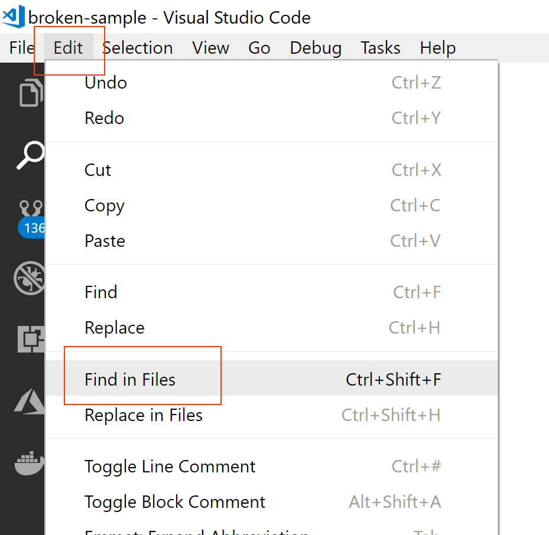
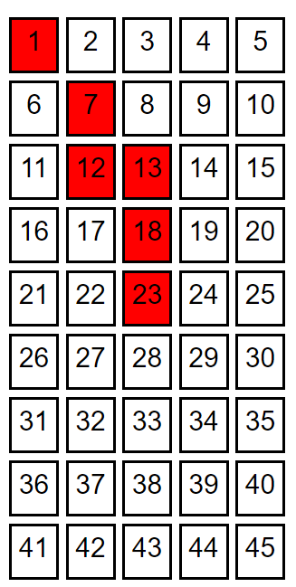

# Test Mobile Computing 24. Mai 2018

## Aufgabe 1 (10 Punkte)

### Einleitung

Ihre Aufgabe ist es, ein bestehendes Angular-Projekt zu reparieren. In dieser Aufgabe sollen Sie zeigen, dass Sie...

* ...Angular-Grundlagen soweit verstanden haben, dass Sie grundlegende Fehler finden und beheben können,
* ...einen client-seitigen Router in Angular konfigurieren können und dass Sie...
* ...ein Angular-Projekt um externe Libraries und Frameworks erweitern können.

### Spezifikation

Öffnen Sie das Projekt [broken-sample](broken-sample) in *Visual Studio Code* und suchen Sie darin nach der Zeichenfolge *BUG:*. Sie werden acht Problembeschreibungen finden.



Für jedes gelöste Problem erhalten Sie einen Punkt. Aufgrund der Komplexität gibt es für die Probleme mit der Router-Konfiguration und der Einbindung von *Bootstrap* jeweils einen Punkt extra. Dadurch ergeben sich in Summe 10 mögliche Punkte.

## Aufgabe 2 (24 Punkte)

### Einleitung

Sie sollen für [*Lotto 6 aus 45*](https://www.win2day.at/lotterie/lotto) eine Web App bauen, mit der man Tipps abgeben und mit Hilfe einer Belegnummer das Ergebnis abfragen kann.

In dieser Aufgabe sollen Sie zeigen, dass Sie...

* ...mit der *Angular CLI* ein neues Angular-Projekt anlegen,
* ...eigene *Angular Komponenten* entwickeln,
* ...eine Web API aufrufen und das Ergebnis im UI darstellen,
* ...mit *Data Binding* umgehen und dass Sie...
* ...einen einfachen client-seitigen Router konfigurieren können.

**Wichtiger Hinweis**: Für dieses Projekt sind die NPM-Packages, die die *Angular CLI* installiert, ausreichend. Sie müssen bei diesem Projekt weder NPM-Packages hinzufügen noch an der Angular-Projektkonfiguration Änderungen vornehmen. Wenn Sie das aus irgend einem Grund möchten, steht Ihnen das natürlich frei.

### Backend Web API

Für diese Aufgabe steht Ihnen eine Backend Web API zur Verfügung, die die folgenden, beiden Methoden anbietet. Die erste wird verwendet, um neue Tipps abzugeben. Die zweite liefert das Ziehungsergebnis für eine angegebene Belegnummer.

**Beachten Sie** dass das Ergebnis in diesem Beispiel vollkommen zufällig ist. Wenn Sie das Ergebnis einer Belegnummer mehrfach abfragen, erhalten Sie mit sehr großer Wahrscheinlichkeit unterschiedliche Werte zurück.

```txt
@baseUrl = http://lotto.westeurope.azurecontainer.io/api

###
# Send a new tip
POST {{baseUrl}}/tip
Accept: application/json
Content-Type: application/json

{
    "numbers": [1, 2, 3, 4, 5, 45],
    "joker": true
}

###
# Get result of a tip with a given receipt number
GET {{baseUrl}}/tip?receiptNumber=12345
Accept: application/json
```

Folgende Regeln gelten bzgl. der Web API:

* Ein Tipp muss aus genau sechs Zahlen (*numbers*) bestehen wobei jede zwischen (inkl.) 1 und 45 liegen muss und keine Zahl doppelt vorkommen darf. Wenn gegen diese Regel verstoßen wird, liefert die Web API *Bad Request* zurück.
* Eine Belegnummer (*receipt number*) ist eine fünfstellige Zahl (d.h. zwischen 10000 und 99999). Bei anderen Belegnummern liefert die Web API *Bad Request* zurück.
* Im Erfolgsfall liefert die Web API immer *OK* zurück.

### Spezifikation

1. (1 Punkt) Erstellen Sie mit der *Angular CLI* ein neues Projekt namens *lotto*. Das Projekt muss einen client-seitigen Router enthalten.

1. (3 Punkte) Die Web App soll zwei Routen bereitstellen. Konfigurieren Sie den client-seitigen Router entsprechend. Hier die Detailanforderungen bzgl. Routing:
    1. `/place-tip` zum Abgeben eines neuen Tipps
    1. `/get-result` zum Abfragen des Ziehungsergebnis
    1. Auf jeder Seite sollen Links enthalten sein, mit denen man zwischen den beiden oben genannten Seiten wechseln kann.

1. (6 Punkte) Die Abgabe des Tipps soll ähnlich gestaltet werden wie ein echter Lottoschein (siehe folgende Abbildung). Durch Klicken auf eine noch nicht gewählte Zahl wird sie in den Tipp aufgenommen. Durch Klicken auf eine bereits gewählte Zahl wird sie aus dem Tipp entfernt. Die gewählten Zahlen müssen z.B. durch einen färbigen Hintergrund hervorgehoben werden (andere, grafische Hervorhebungen sind genauso erlaubt).

    

1. (1 Punkt) Zusätzlich zum Tipp kann der Benutzer z.B. mit einer Checkbox wählen, ob er beim *Joker*-Spiel mitmachen möchte. Nutzen Sie *Data Binding*, um dieses Eingabefeld an eine Membervariable im TypeScript-Code zu binden.

1. (5 Punkte) Wenn der Tipp vollständig ist, d.h. wenn der Benutzer genau sechs Zahlen ausgewählt hat, kann er über einen *Button* den Tipp abschicken. Hier die Detailanforderungen:
    1. Der Button muss *disabled* sein, solange der Tipp nicht vollständig ist.
    1. Abschicken bedeutet, dass die Web API `POST /api/tip` aufgerufen wird.
    1. Das Ergebnis des Web API-Aufrufs, insbesondere die Belegnummer, muss am Bildschirm ausgegeben werden.

1. (5 Punkte) Für die Abfrage des Ziehungsergebnis kann der Benutzer eine Belegnummer eingeben. Mit einem *Button* kann er die Abfrage starten. Der Button muss *disabled* sein, solange die Belegnummer ungültig ist (d.h. kleiner als 10000 oder größer als 99999).
    1. Die Abfrage erfolgt durch Aufruf der Web API `GET /api/tip`.
    1. Das Ergebnis des Web API-Aufrufs (Anzahl der richtigen Zahlen und Hinweis, ob bzgl. Zusatzzahl) muss am Bildschirm ausgegeben werden.

1. (3 Punkte) Die Ausgabe des Ergebnisses muss nach folgendem Schema erfolgen:

    | Anzahl richtige Zahlen | Zusatzzahl | Ausgabe
    |------------------------|------------|---
    | 0                      |            | Sie haben leider keine richtigen Zahlen und daher nichts gewonnen
    | 1                      |            | Sie haben nur eine richtige Zahl und daher nichts gewonnen
    | 2                      |            | Sie haben nur zwei richtige Zahlen und daher nichts gewonnen
    | 3                      |            | Gratuliere, Sie haben einen Dreier
    | 4                      |            | Gratuliere, Sie haben einen Vierer
    | 5                      | `false`    | Gratuliere, Sie haben einen Fünfer
    | 5                      | `true`     | Gratuliere, Sie haben einen Fünfer mit Zusatzzahl
    | 6                      |            | Jackpot!

## Generelle Anforderungen

1. (1 Punkt) Checken Sie Ihre Lösung in GitHub ein. Sie erhalten den Namen des Repositories am Beginn des Tests über *GitHub Classroom*

1. Stellen Sie sicher, dass Ihr Code keine Linter-Fehler enthält (d.h. `npm run lint` läuft fehlerlos durch). Falls es Linter-Fehler in Ihrem Code gibt, wird ein Punkt abgezogen.
