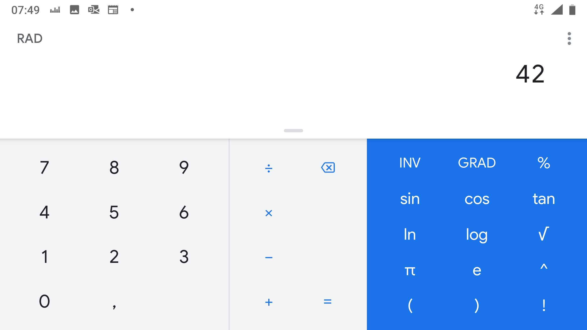
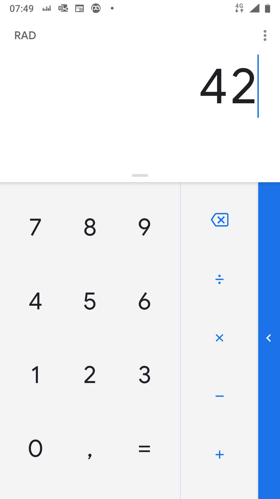

# Responsive Calculator

## Introduction

You job is to implement an Angular app that displays a responsive calculator similar to Android's calculator (see screenshots below).

You must not use a CSS framework like *Angular Material*. You should use [*Angular FlexLayout*](https://github.com/angular/flex-layout).

## Landscape

## Portrait

Implementing a *drawer* to display scientific operations is optional. It is ok if scientific operations are not available in portrait mode.

## Extra Points

Send me a link to your solution made available on the web (e.g. *Stackblitz*) to earn one extra point.

If your calculator does not only contain a correct responsive layout but can also execute basic mathematical functions (adding, subtracting, multiplying, dividing numbers), you will get a second extra point.
