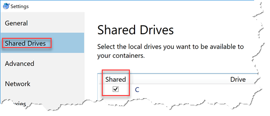
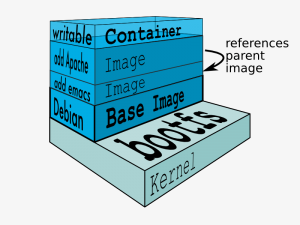

# Docker

Introduction to [Docker](https://www.docker.com/)


<!-- .slide: class="left" -->
## What is *Docker*?

* Product/Company that made *Container* technology very popular
* In classical *Virtual Machines* (VM), dach VM runs its own guest operating system
* Containers **reuse** the host operating system
* Container run in user space
* Not a total replacement of classical hypervisors!
* Editions
  * Community Edition (free)
  * Enterprise Edition
* Learn more in [Docker docs...](https://docs.docker.com/)


<!-- .slide: class="left" -->
## What is *Docker*?


[Image Source and more information...](https://docs.docker.com/get-started/#containers-vs-virtual-machines)


<!-- .slide: class="left" -->
## Advantages and Disadvantages

* Advantages
  * Fast (boot time), small, and agile (e.g. Docker in Docker)
  * Portable
  * Immutable
* Disadvantages
  * Linux on Linux and Windows on Windows, no mix (yet)
  * Security (less isolated)


<!-- .slide: class="left" -->
## Technical Components

* Isolation layers
  * Filesystem - each container has its own filesystem (layered, copy-on-write)
  * Processes - each container has its own process environment
  * Network - separate virtual network interfaces
  * Resources - individually allocated CPUs, memory
* Logging - STDOUT, STDERR, STDIN are logged for analysis purposes
* Interactive shell - Pseudo-tty attached to STDIN


<!-- .slide: class="left" -->
## Installation

* Windows and macOS: [Docker for Windows/macOS](https://docs.docker.com/engine/installation/#desktop) is recommended
* Runs natively on [Linx servers](https://docs.docker.com/engine/installation/#server)
* Connect to remote Docker engine
  * Set environment variables (e.g. `DOCKER_HOST`)
  * [Read more...](https://docs.docker.com/engine/reference/commandline/cli/#environment-variables)
  * E.g. `export DOCKER_HOST=tcp://192.168.1.99:2376` to access Docker running on server with the specified IP address


<!-- .slide: class="left" -->
## Containers

* Launched from images
  * Layered, copy-on-write
* Contain one or more processes
  * Can be short-lived
  * Sometimes even to run just a single command
* Shared via *registries*
  * [Docker Hub](https://hub.docker.com) (private and public repositories)
  * Run your own private registry


<!-- .slide: class="left" -->
## Containers

Operation | Docker CLI command
---|---
Start a new container | [`docker run`](https://docs.docker.com/engine/reference/commandline/run/)
List running containers | [`docker ps`](https://docs.docker.com/engine/reference/commandline/ps/)
Stop container | [`docker stop`](https://docs.docker.com/engine/reference/commandline/stop/)
Start a stopped container | [`docker start`](https://docs.docker.com/engine/reference/commandline/start/)
Attach to a running container | [`docker attach`](https://docs.docker.com/engine/reference/commandline/attach/)
Displays processes in container | [`docker top`](https://docs.docker.com/engine/reference/commandline/top/)
Run process in container | [`docker exec`](https://docs.docker.com/engine/reference/commandline/exec/)
Remove container | [`docker rm`](https://docs.docker.com/engine/reference/commandline/rm/)


<!-- .slide: class="left" -->
## Start Containers

* Interactive container:

```
docker run --name helloDocker -i -t ubuntu /bin/bash
           |                  |  |  |      |
           |                  |  |  |      +-- Command to run
           |                  |  |  +--------- Base image
           |                  |  +------------ Attach pseudo-tty
           |                  +--------------- Keep STDIN open
           +---------------------------------- Name of container
```


<!-- .slide: class="left" -->
## Start Containers

* Background process:

```
docker run -d ubuntu /bin/bash -c "while true; do echo hello world; sleep 1; done"
           |
           +---- Detached (=background server process)
```

* Try running (`run`), stopping (`stop`), starting (`start`), listing (`ps`), removing (`rm`), etc. containers


<!-- .slide: class="left" -->
## Network Connections

```
docker run -d -p 8080:80 nginx
              |  |    |  |
              |  |    |  +-- nginx web server
              |  |    +----- Container port (nginx)
              |  +---------- Host port (your desktop/server)
              +------------- Port mapping
```

* Try running your own [nginx](https://hub.docker.com/_/nginx/) web server in Docker


<!-- .slide: class="left" -->
## Volume Mapping

```
docker run -it --rm -v C:\temp\htl-csharp-linq:/data ubuntu
               |    |  |                       |
               |    |  |                       +---- Folder in container
               |    |  +---------------------------- Folder on host (e.g. your desktop)
               |    +------------------------------- Volume mapping
               +------------------------------------ Remove container after exit
```

* Don't forget to enable sharing if you use *Docker for Windows*:<br/>
  


<!-- .slide: class="left" -->
## Docker Images

* [Union-mount](http://en.wikipedia.org/wiki/Union_mount) file system over the read-only file system
  * Multiple file systems stacked on top of each other
* Only top-most file system is writable
  * [Copy-on-write](http://en.wikipedia.org/wiki/Copy-on-write)




<!-- .slide: class="left" -->
## Image Operations

Operation | Docker CLI command
---|---
List images | [`docker images`](https://docs.docker.com/engine/reference/commandline/images/)
Search images | [`docker search`](https://docs.docker.com/engine/reference/commandline/search/)
Pull image from Docker Hub | [`docker pull`](https://docs.docker.com/engine/reference/commandline/pull/)
Push image to Docker Hub | [`docker push`](https://docs.docker.com/engine/reference/commandline/push/)


<!-- .slide: class="left" -->
## Important Images

Images important for this course

Image | Description
---|---
[`ubuntu`](https://hub.docker.com/_/ubuntu/) | Ubuntu Linux OS
[`node`](https://hub.docker.com/_/node/) | Base image for Node.js applications
[`nginx`](https://hub.docker.com/_/nginx/) | Webserver, reverse proxy, load balancer, etc.
[`microsoft/dotnet`](https://hub.docker.com/r/microsoft/dotnet/) | Base image for .NET Core applications
[`openjdk`](https://hub.docker.com/_/openjdk/) | Base image for Java applications
[`couchdb`](https://hub.docker.com/_/couchdb/) | CouchDB


<!-- .slide: class="left" -->
## Dockerfiles

* Build images automatically based on instructions from a *Dockerfile*
* Text file that contains all the commands needed to build a given image
* Use `docker build` to generate image from *Dockerfile*
* [Read more...](https://docs.docker.com/engine/reference/builder/)


<!-- .slide: class="left" -->
## Dockerfile Sample

```
FROM nginx
MAINTAINER Rainer Stropek "rainer@timecockpit.com"
ENV REFRESHED_AT 2018-01-01
RUN apt-get -qq update
COPY *.html /usr/share/nginx/html/
```

```
docker build -t staticweb .
docker run --name staticwebcontainer -d -p 80:80 staticweb
```
