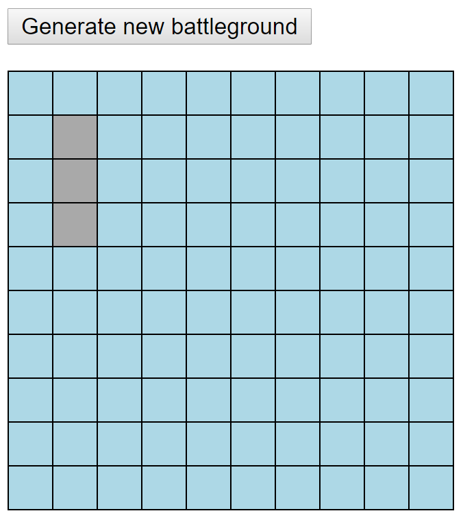

# *Battleship* Quiz

## Introduction

[*Battleship*](https://en.wikipedia.org/wiki/Battleship_(game)) is a famous guessing game. Your job is to write an algorithm filling an initially empty battleship board (aka *battleground*) **randomly** with ships. The following image shows a battleground with a single ship of length 3:

1. Everybody has to do his/her best to come up with a solution.

1. Earn one point for your grade by sending me a URL where I can try your solution in the public Internet.

1. Earn my **deepest respect** if you add an automated unit test to your solution. You don't know how? Remember the [*Converter* quiz](https://github.com/rstropek/htl-mobile-computing/tree/master/node-fundamentals/9030-converter) you have already done. It contained unit tests that I wrote. My code from the *Converter* quiz can help you to get on the right track to creating your own unit tests for this quiz.

## Specification

You have to position the following ships randomly on the battleground:

| Ship       | Length |
|------------|--------|
| Carrier    | 5      |
| Battleship | 4      |
| Cruiser    | 3      |
| Submarine  | 3      |
| Destroyer  | 2      |

The following rules have to be observed when placing the ships:

* Each ship occupies a number of *consecutive squares* on the grid, arranged either horizontally or vertically.

* The number of squares for each ship is determined by the type of the ship (see table above).

* The ships *cannot overlap* (i.e., only one ship can occupy any given square in the grid). 

* The ships *must not be directly adjacent* to each other (i.e., at least one square with water has to be between the ships).

## Hints

1. An HTML file ([battleship.html](battleship.html)) has been prepared for you. Note that it references [jQuery](http://jquery.com/). You have to get *jQuery* from *NPM* yourself.

1. A CSS file ([battleship.css](battleship.css)) has been prepared for you. It does all the necessary formatting for you and includes CSS classes for *water* cells and cells with *ships*.

1. A JavaScript file ([battleship.js](battleship.js)) has been prepared for you. You can use it as a starting point. It already generates the HTML grid for the battleground. You have to add the algorithm for randomly placing ships.

1. Note that [package.json](package.json) contains a script *start*. You can run it with `npm start`. It uses a package called *browser-sync*. Find this package on NPM. Find out what it does. Install it and try to use it while working on your solution.
