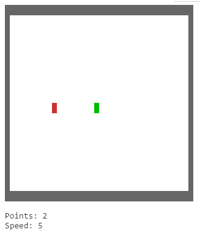
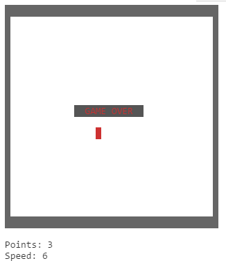

# Simple Snake Game

## Introduction

In this exercise you have to implement a simple [Snake](https://en.wikipedia.org/wiki/Snake_(video_game)) game in a Node.js command line program.

## Requirements

### Input/Output (I/O)

* All output should be written to `stdout`
* Use the NPM packages `ansi` and `keypress` for I/O

### Game Board

* The snake must be represented by a filled, green cursor
* The apple must be represented by a filled, red cursor
* A *Game Over* message must appear once the game is over

### Game Logic

* Initially, the snake is positioned in the middle of the game board and automatically moves to the right
* The snake's direction can be controlled using the cursor keys
* If the snake reaches the apple, the number of points are increased and the moving speed increases. Additionally, a new apple appears on a random position inside the game board
* If the player hits the wall of the game board, the game is over

Note that in contrast to the original game, the snake does not grow in length over time. Once you have solved this exercise, you can add this logic if you like an additional challenge.

## Hints

* [ANSI Escape Codes](https://en.wikipedia.org/wiki/ANSI_escape_code)
  * You can clear the screen with `process.stdout.write('\x1Bc');`
  * You can hide the cursor with `process.stdout.write('\x1B[?25l');`
  * You can show the cursor with `process.stdout.write('\x1B[?25h');`

## Advanced Exercises

* Make sure your source code is [*Lint*](https://en.wikipedia.org/wiki/Lint_(software)) warning free by [checking it online](http://eslint.org/demo/). Make sure to set the following *rule configuration*:
  * ECMA Version *6*
  * Environment *node*
* Create an enhanced version of the game in which the snake's length grows whenever it eats an apple

## Solution

You can find a sample solution (deliberately without comments) in [*snake.js*](snake.js). However, before you take a look at it, try to find your own solution!
