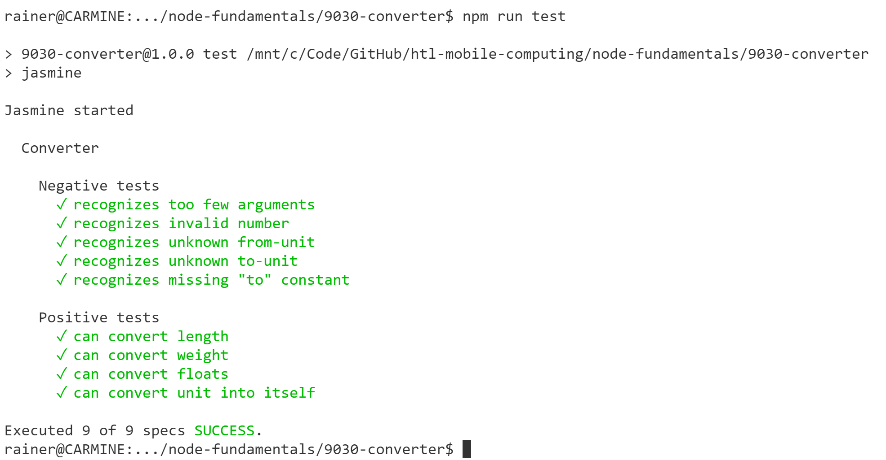

# *Converter* Quiz

## Introduction

Implement a command-line Node.js application named `convert.js` that can convert lengths and weights. You can check if your code is correct by running the unit tests in [converter.spec.js](spec/converter.spec.js).

1. Everybody has to do his/her best to come up with a solution.

1. Earn one point for your grade by delivering a solution that passes all unit tests.

1. Earn my **deepest respect** ;-) if you manage to implement the entire program in less than 10 lines of code. It is possible, I will teach you how.

## Specification

`convert.js` receives exactly four parameters:

1. A *float* value that should be converted (e.g. *5*).
1. A source unit (e.g. *m* = meters).
1. The constant string *to*.
1. A target unit (e.g. *cm* = centimeters).

Therefore, a typical call looks like this `node convert.js 5 m to cm`.

`convert.js` must print its result to *stdout*. The result of the previous example should be: *5 m are 500 cm*. If wrong parameters were specified, the result on *stdout* should be: *Invalid parameters*.

The converter must be able to convert

1. the length units *m* (meters), *cm* (centimeters) and *mm* (millimeters).
1. the weight units *kg* (kilograms) and *g* (grams).

Each length unit can be converted into each other length unit including itself (e.g. *5 m to m* results in *5 m are 5 m*). Each weight unit can be converted into each other weight unit including itself. Length units cannot be converted into weight units and vice versa (must result in *Invalid parameters*).

## Hints

To run the unit tests and check your solution, execute the following steps:

1. Open a command line/terminal window and navigate to the root directory of this quiz.

1. Run `npm install` to get the NPM packages necessary for running the tests.

1. Whenever you want to run the unit tests, execute `npm run test`. The result will be something like this:

