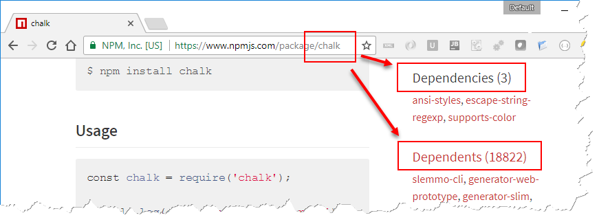

# NPM Fundamentals

Introduction to the [Node Package Manager](https://www.npmjs.com/)


<!-- .slide: class="left" -->
## [What is NPM?](https://docs.npmjs.com/getting-started/what-is-npm)

* Platform for creating reusable code *packages* (aka *modules*)
  * Metadata (`package.json`)
  * Tooling (`npm`) installed with Node.js
  * [NPM Website](https://www.npmjs.com/)
* Version management
* It is huge!
  * Over 500k packages
  * Over 10 billion downloads per month


<!-- .slide: class="left" -->
## Installing a Package

* Open a shell in an *empty folder*
* Search for package [*Chalk*](https://www.npmjs.com/package/chalk): `npm search chalk`
  * Search online on [npmjs.com](https://www.npmjs.com)
* Run: `npm install chalk`
* Create `app.js` using the [*Chalk*](https://www.npmjs.com/package/chalk) package
```
const chalk = require('chalk');
console.log(chalk.red.bgBlue('Hello world!'));
```
* Run program: `node app.js`


<!-- .slide: class="left" -->
## *node_modules* Folder

* Stores all locally installed packages
  * ...and their dependencies, and the dependencies of the dependencies...
* Can contain large number of files
  * Don't copy it from machine to machine
  * Never check it in into [Source Code Control](https://en.wikipedia.org/wiki/Source_Code_Control_System)
* Problems
  * How to find out which packages a program needs?
  * How to find out if new versions of packages are available?
  * How to reinstall necessary packages on a target machine?
* Solution: `package.json`


<!-- .slide: class="left" -->
## Creating *package.json*

* Open a shell in an *empty folder*
* Run: `npm init`
* Answer questions (hit *enter* to accept default)
* Run: `npm install chalk`
* Take a look at the generated `package.json` file, especially note `dependencies` object

```
{
  "name": "npmdemo",
  "version": "1.0.0",
  "description": "...",
  ...
  "dependencies": {
    "chalk": "^2.0.1"
  }
}
```


<!-- .slide: class="left" -->
## Version Numbers in *package.json*

* `3.5.0` means: Take currently latest version of the package
  * It does *not* mean: Take version `3.5.0`
* `^3.5.0` means: Take most recent major version (i.e. `3.x.x`)
* `~3.5.0` means: Take most recent minor version (i.e. `3.5.x`)
* Related: [Semantic Versioning](http://semver.org/) standard
* Install a specific version of a package with e.g. `npm install chalk@^1.0.0`


<!-- .slide: class="left" -->
## Dependency Tree



* Recursive tree of dependencies
* Cached in `package-lock.json`
  * Exercise: Open `package-lock.json` and view dependencies
* Visualize dependency tree in [2d](http://npm.anvaka.com/#/view/2d/chalk) or [3d](https://anvaka.github.io/allnpmviz3d/#)


<!-- .slide: class="left" -->
## *package.json* Content

* Package metadata (e.g. author, description, etc.)
* Version number
  * Tip: Follow [Semantic Versioning](http://semver.org/) standard
* Dependencies
  * Necessary at runtime (`dependencies`)
  * Necessary at compile time (`devDependencies`, `--save-dev` option, will later be important for *TypeScript*)
* Collection of scripts ([*npm scripts*](https://docs.npmjs.com/misc/scripts))
  * Run at certain events (e.g. after install)
  * Run with `npm run script-name`
* Exercise: Inspect [*package.json* from *jQuery*](https://github.com/jquery/jquery/blob/master/package.json)
* Read more [details about *package.json*](https://docs.npmjs.com/files/package.json)


<!-- .slide: class="left" -->
## Further Readings and Exercises

* Want to know more? Read/watch...
  * [NPM docs](https://docs.npmjs.com/)
* Exercises
  * [*Snake exercise*](https://github.com/rstropek/htl-mobile-computing/blob/master/node-fundamentals/9020-simple-snake/readme.md)
