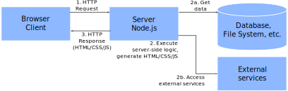
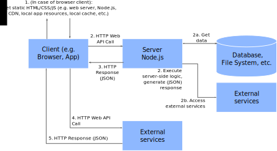

# RESTful Web APIs

Introduction to [REST](https://en.wikipedia.org/wiki/Representational_state_transfer)ful Web APIs


<!-- .slide: class="left" -->
## What is *REST*?

* [*Representational state transfer*](https://en.wikipedia.org/wiki/Representational_state_transfer):
  * Originally for accessing and manipulating textual representations of Web resources using a set of stateless operations
  * Today: More generic, encompassing every entity that can be identified, named, addressed or handled, in any way whatsoever, on the Web
* Architectural pattern, not a standard
  * [Request-response](https://en.wikipedia.org/wiki/Request%E2%80%93response) pattern
* Today, [HTTP](https://en.wikipedia.org/wiki/Hypertext_Transfer_Protocol)-based RESTful APIs dominate
  * [URLs](https://en.wikipedia.org/wiki/URL) for addressing
  * [JSON](https://en.wikipedia.org/wiki/JSON), sometimes XML for representing data elements
  * Standard [HTTP methods](https://en.wikipedia.org/wiki/Hypertext_Transfer_Protocol#Request_methods) aka *verbs* (e.g. *GET*, *PUT*, *POST*, and *DELETE*)
  * Standard [HTTP status codes](https://en.wikipedia.org/wiki/List_of_HTTP_status_codes) for representing results
  * [HTTP header fields](https://en.wikipedia.org/wiki/List_of_HTTP_header_fields) ([standard](https://en.wikipedia.org/wiki/List_of_HTTP_header_fields#Request_fields) or custom) for sending parameters
  * [TLS](https://en.wikipedia.org/wiki/Transport_Layer_Security) for encrypting [data in-transit](https://en.wikipedia.org/wiki/Data_in_transit)


<!-- .slide: class="left" -->
## Important Tools (Examples)

* API Clients
  * [*Postman*](https://www.getpostman.com/)
  * [*Insomnia*](https://insomnia.rest/)
  * [*REST Client*](https://marketplace.visualstudio.com/items?itemName=humao.rest-client) in *Visual Studio Code*
* Web Debugger
  * [*Fiddler*](http://www.telerik.com/fiddler)
* HTTP Request and Response Service
  * [*httpbin.org*](https://httpbin.org)


<!-- .slide: class="left" -->
## Sample Requests

```
<!--#include file="rest-fundamentals/0010-rest-clients/pokeapi.http" -->
```

```
<!--#include file="rest-fundamentals/0010-rest-clients/northwind.http" -->
```
Exercise: Try this sample with different REST clients


<!-- .slide: class="left" -->
## Sample Requests (cont.)

```
<!--#include file="rest-fundamentals/0010-rest-clients/post.http" -->
```
Exercise: Try this sample with different REST clients


<!-- .slide: class="left" -->
## Important REST principles

* Stateless
  * No client context stored on the server
  * Each request is complete
* Cacheable
  * Responses explicitly indicate their cacheability
* Layered System
  * Client cannot tell if connected directly to the server (e.g. reverse proxies)
* URIs
  * Resources are identified using *Uniform Resource Identifiers* (URIs)
* Resource representation
 * *XML*, *JSON*, *Atom* - today mostly JSON


<!-- .slide: class="left" -->
## RESTful Web APIs in the Browser

* Old but still relevant: [*XMLHttpRequest*](https://developer.mozilla.org/en-US/docs/Web/API/XMLHttpRequest)
* Newer, but only in modern browsers: [*fetch*](https://developer.mozilla.org/en-US/docs/Web/API/GlobalFetch)
  * [Detailed MDN documentation about *fetch*...](https://developer.mozilla.org/en-US/docs/Web/API/WindowOrWorkerGlobalScope/fetch)

```
<!--#include file="rest-fundamentals/0020-rest-client/app-promise.js" -->
```


<!-- .slide: class="left" -->
## RESTful Web APIs in the Browser (cont.)

With `async/await`:

```
<!--#include file="rest-fundamentals/0020-rest-client/app.js" -->
```


<!-- .slide: class="left" -->
## RESTful Web APIs in  the Browser (cont.)

With [*jQuery*](http://api.jquery.com/jQuery.get/):

```
<!--#include file="rest-fundamentals/0020-rest-client/app-jquery.js" -->
```


<!-- .slide: class="left" -->
## Building RESTful Web APIs with Node.js

* In practice, frameworks are used for that
* Here: [*Express.js*](http://expressjs.com/)
  * Larger framework, not just for RESTful Web APIs
  * Very commonly used
  * Lots of plugins
* Installation
  * `npm install express`
  * For TypeScript: `npm install @types/express --save-dev`


<!-- .slide: class="left" -->
## RESTful Web API with [*Express.js*](http://expressjs.com/)

```
<!--#include file="rest-fundamentals/0030-express-basics/app.ts" -->
```

```
<!--#include file="rest-fundamentals/0030-express-basics/request.http" -->
```


<!-- .slide: class="left" -->
## RESTful Web API with [*Express.js*](http://expressjs.com/)

* `express()` function
  * Creates an Express application
  * [Documentation](https://expressjs.com/en/4x/api.html#express)
* Application
  * Represents the Express application
  * Created with `express()`
  * [Documentation](https://expressjs.com/en/4x/api.html#app)
* `request` object
  * Represents the HTTP request
  * Use it to get headers, parameters, body, etc.
  * [Documentation](https://expressjs.com/en/4x/api.html#req)
* `response` object
  * Represents the HTTP response
  * Use it to build response (e.g. status, headers, body, etc.)
  * [Documentation](https://expressjs.com/en/4x/api.html#res)


<!-- .slide: class="left" -->
## [*Express.js*](http://expressjs.com/) Examples

```
<!--#include file="rest-fundamentals/0040-express-verbs/app.ts" -->
```


<!-- .slide: class="left" -->
## [*Express.js*](http://expressjs.com/) Examples (cont.)

```
<!--#include file="rest-fundamentals/0040-express-verbs/data.ts" -->
```

```
<!--#include file="rest-fundamentals/0040-express-verbs/get-all.ts" -->
```


<!-- .slide: class="left" -->
## [*Express.js*](http://expressjs.com/) Examples (cont.)

```
<!--#include file="rest-fundamentals/0040-express-verbs/get-single.ts" -->
```


<!-- .slide: class="left" -->
## [*Express.js*](http://expressjs.com/) Examples (cont.)

```
<!--#include file="rest-fundamentals/0040-express-verbs/post.ts" -->
```


<!-- .slide: class="left" -->
## [*Express.js*](http://expressjs.com/) Examples (cont.)

```
<!--#include file="rest-fundamentals/0040-express-verbs/delete-single.ts" -->
```


<!-- .slide: class="left" -->
## [*Lokijs*](http://lokijs.org/)

* Lightweight in-memory key-value store
* Fast and easy to use
* Works in...
  * ...browser
  * ...apps
  * ...Node.js on the server or in the command line
* Persistence adapter can write data to disk/[indexeddb](https://developer.mozilla.org/de/docs/IndexedDB)


<!-- .slide: class="left" -->
## [*Lokijs*](http://lokijs.org/)

```
<!--#include file="rest-fundamentals/0050-express-loki/db.ts" -->
```


<!-- .slide: class="left" -->
## [*Express.js*](http://expressjs.com/) Examples with [*Lokijs*](http://lokijs.org/)

```
<!--#include file="rest-fundamentals/0050-express-loki/app.ts" -->
```


<!-- .slide: class="left" -->
## [*Express.js*](http://expressjs.com/) Examples with [*Lokijs*](http://lokijs.org/) (cont.)

```
<!--#include file="rest-fundamentals/0050-express-loki/get-all.ts" -->
```


<!-- .slide: class="left" -->
## [*Express.js*](http://expressjs.com/) Examples with [*Lokijs*](http://lokijs.org/) (cont.)

```
<!--#include file="rest-fundamentals/0050-express-loki/get-single.ts" -->
```


<!-- .slide: class="left" -->
## [*Express.js*](http://expressjs.com/) Examples with [*Lokijs*](http://lokijs.org/) (cont.)

```
<!--#include file="rest-fundamentals/0050-express-loki/post.ts" -->
```


<!-- .slide: class="left" -->
## [*Express.js*](http://expressjs.com/) Examples with [*Lokijs*](http://lokijs.org/) (cont.)

```
<!--#include file="rest-fundamentals/0050-express-loki/delete-single.ts" -->
```


<!-- .slide: class="left" -->
## [*Express.js*](http://expressjs.com/) Server-Side Rendering

* Express.js also supports *server-side rendering*
* HTML is generated on the server-side
  * Many different [template engines](https://github.com/expressjs/express/wiki#template-engines) are supported
  * Here we use [handlebars](http://handlebarsjs.com/)
* Server-Side Rendering can be combined with client-side logic


<!-- .slide: class="left" -->
## Server-side rendering




<!-- .slide: class="left" -->
## Server-side rendering

* Client is a browser
  * Explicitly started by user
  * Embedded browser (e.g. [CEFSharp](https://github.com/cefsharp/CefSharp), [WebView](https://developer.chrome.com/multidevice/webview/gettingstarted))
* Most of the business logic runs on the server
  * Minor parts of the logic runs on the client<br/>
    (e.g. form validation in JavaScript)
  * Server accesses databases and external services
* Server generates HTML, CSS, JavaScript


<!-- .slide: class="left" -->
## Web APIs + Single Page Apps (SPA)




<!-- .slide: class="left" -->
## Web APIs + Single Page Apps (SPA)

* Client can be a browser
  * Anything that can speak HTTP, JSON, etc.<br/>
    (e.g. mobile app, CLI, server, desktop app, IoT device)
* Static HTML/CSS/JS for SPA
* Logic
  * HTTP Web API requests for running server-side business logic
  * View logic (e.g. manipulating DOM) runs on client
  * [JSON](https://rstropek.github.io/htl-mobile-computing/#/3/7) for transmitting data


<!-- .slide: class="left" -->
## [*Express.js*](http://expressjs.com/) Server-Side Rendering

```
<!--#include file="rest-fundamentals/0060-express-server-side-html/src/app.ts" -->
```


<!-- .slide: class="left" -->
## [*Express.js*](http://expressjs.com/) Server-Side Rendering (cont.)

```
<!--#include file="rest-fundamentals/0060-express-server-side-html/src/views/index.hbs" -->
```


<!-- .slide: class="left" -->
## Further Readings and Exercises

* Want to know more? Read/watch...
  * [Microsoft's REST API Guidelines](https://github.com/Microsoft/api-guidelines/blob/vNext/Guidelines.md)
  * [*Express.js* documentation](https://expressjs.com/)
* Exercises
  * [*CouchDB* exercise](https://github.com/rstropek/htl-mobile-computing/blob/master/rest-fundamentals/9010-couch/readme.md)
  * [*RSVP* exercise](https://github.com/rstropek/htl-mobile-computing/blob/master/rest-fundamentals/9020-birthday-party/readme.md)
