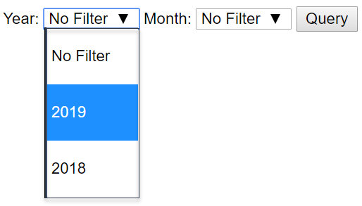
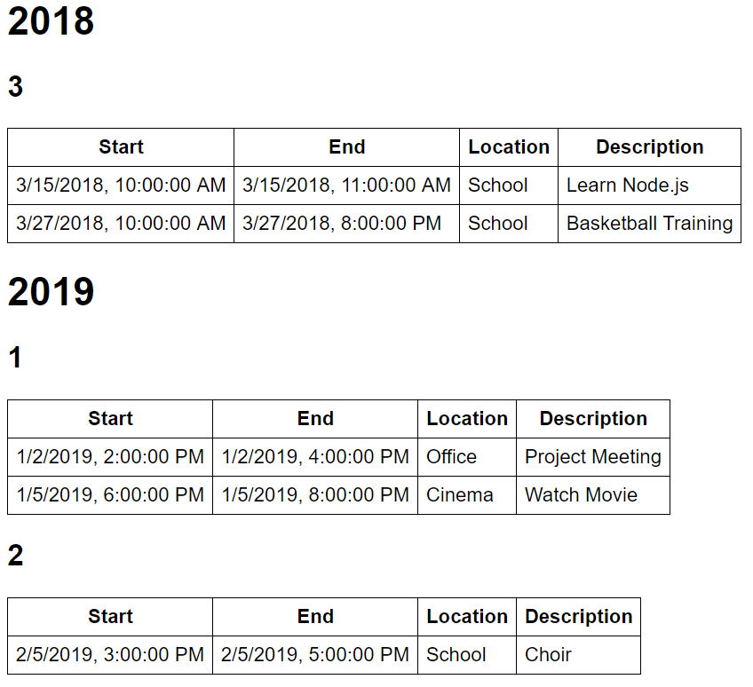

# Test

## Einleitung

Ihre Aufgabe ist die Entwicklung eines einfachen Frontends für einen elektronischen Kalender.

## Technische Rahmenbedingungen

* Verwenden Sie zur Entwicklung des Programms TypeScript >= 3.x und HTML.

* Entscheiden Sie selbst, welche Funktionen bzw. welches Framework Sie zum Aufrufen der Web API verwenden möchten.

* Sie können davon ausgehen, dass Strings mit der [JavaScript-Methode `parse`](https://developer.mozilla.org/en-US/docs/Web/JavaScript/Reference/Global_Objects/Date/parse) in ein `Date`-Objekt umgewandelt werden können (ist erst seit ES5 empfehlenswert).

* Es ist nicht notwendig, die Anwendung aufwendig mit CSS zu gestalten oder sogar ein CSS-Framework einzusetzen. Gute, grafische Gestaltung bringt keine Extrapunkte.

## Anforderungen

### Mindestanforderungen (10 Punkte)

Ihr Programm muss die folgenden Anforderungen erfüllen, damit Ihr Test positiv beurteilt werden kann. Aber keine Sorge, kleinere Fehler in diesem Bereich führen nicht sofort zu einer negativen Note sondern nur zu Punktabzügen.

* (1 Punkt) Ihr Programm muss die im Unterricht besprochenen Empfehlungen (*Best Practices*) für Web-Projekte einhalten (z.B. Konfigurationsdateien mit entsprechendem Inhalt, Git *ignore* file, etc.).

* (1 Punkt) Schreiben Sie leicht lesbaren, ordentlich formatierten Code mit sinnvollen Namen für Variablen, Funktionen und Typen.

* (2 Punkte) Der Benutzer muss in Ihrem Frontend die Möglichkeit haben, **optional** einen **Filter für Jahr und/oder Monat** einzugeben. Mindestanforderung sind zwei Eingabefelder (`<input .../>`). Beachten Sie die optionale Zusatzanforderung für die Eingabefelder unten.

* (4 Punkte) **Fragen Sie die Termine ab** (Englisch: *Appointments*) mit Hilfe der Web API unter [`http://52.236.149.254/api/calendar`](http://52.236.149.254/api/calendar). Beachten Sie dabei:
  * Ein Termin hat einen Start- und einen Endzeitpunkt (`start` und `end`).
  * Ein Termin hat einen Ort (`loc`).
  * Ein Termin hat eine Beschreibung (`desc`).
  * Mit dem Querystring-Parameter `year` können Sie nach Jahr filtern (z.B. `http://52.236.149.254/api/calendar?year=2019`).
  * Mit dem Querystring-Parameter `month` können Sie nach Monat filtern (z.B. `http://52.236.149.254/api/calendar?month=1`).
  * Sie können Jahres- und Monatsfilter kombinieren (z.B. `http://52.236.149.254/api/calendar?year=2019&month=1`).

* (2 Punkte) Geben Sie das Ergebnis der Abfrage als HTML Tabelle aus. [Sortieren](https://developer.mozilla.org/en-US/docs/Web/JavaScript/Reference/Global_Objects/Array/sort) Sie die Zeilen dabei nach `start`.

### Optionale Anforderungen (10 Punkte)

Die Lösung folgender Anforderungen ist für eine positive Beurteilung nicht unbedingt notwendig, sie verbessert aber Ihre Note.

* (3 Punkte) Setzen Sie die **optionalen** Filter für Jahr und Monat als **Auswahlboxen** um. Hier ein Beispiel, wie das aussehen könnte: 
  

* (3 Punkte) Geben Sie die Jahre für den **Jahresfilter** nicht fix im Code an sondern **laden Sie die Auswahlmöglichkeiten** aus [`http://52.236.149.254/api/calendar/years`](http://52.236.149.254/api/calendar/years)

* (3 Punkte) **Gliedern Sie die Ergebnistabelle** nach Jahr und Monat. Pro Jahr muss eine `<h1>`-Überschrift und pro Monate eine `<h2>`-Überschrift ausgegeben werden. Hier ein Beispiel, wie das aussehen könnte: 
  

* (1 Punkt) Verwenden Sie den TypeScript-Datentyp `any` nicht, weder explizit noch implizit.
