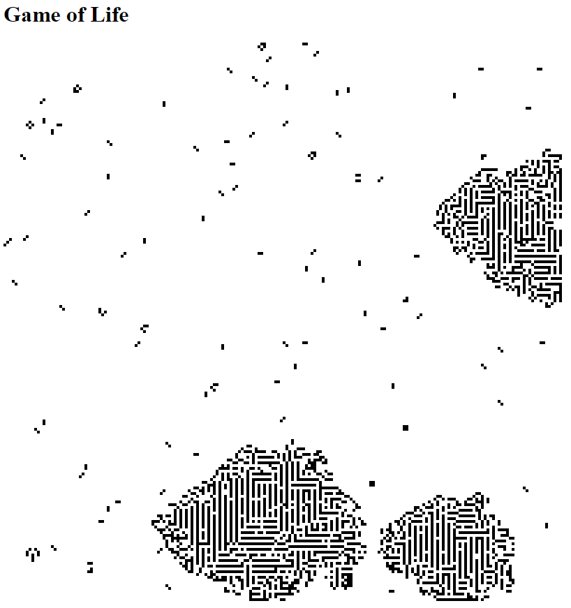

# Game of Life

## Introduction

In this exercise you have to implement [Conway's Game of Life](https://en.wikipedia.org/wiki/Conway%27s_Game_of_Life) in TypeScript. Before starting with this exercise, make yourself familiar with *Game of Life* by reading the [Wikipedia article](https://en.wikipedia.org/wiki/Conway%27s_Game_of_Life).

## Requirements

* Create a very simple HTML page `index.html` that contains a [HTML5 `canvas` element](https://developer.mozilla.org/en-US/docs/Web/API/Canvas_API#HTML).
* Create a TypeScript file `app.ts`. It has to be compiled to `app.js` by TypeScript.
* Include the resulting `app.js` in the previously created HTML page.
* Your *Game of Life* grid must have a size of 200 by 200 cells.
* Initially, random 3% of all grid cells must be alive. All other cells must initially be dead.
* Each cell must be represented on the screen by a black square with side length of 4 pixel. Here is a screenshot showing how the game board must finally look like when the game is running:



* Write your code so that it is very simple to experiment with other grid sizes, pixel sizes and initial ratios of alive cells.
* Implement the *Game of Life* algorithm with the classic rules:
  * Any live cell with fewer than two live neighbors dies, as if caused by underpopulation.
  * Any live cell with two or three live neighbors lives on to the next generation.
  * Any live cell with more than three live neighbors dies, as if by overpopulation.
  * Any dead cell with exactly three live neighbors becomes a live cell, as if by reproduction.
* Your *Game of Life* algorithm must start immediately after the HTML page has been loaded. It must run continuously in an endless loop until the user closes the browser or reloads the page.

## Hints

* Here is an example code that shows how to get a reference to the `canvas` in TypeScript and set some configuration options (size, fill color):

```
const canvas = <HTMLCanvasElement>document.getElementById('canvas');
canvas.width = canvas.height = boardSize;
const ctx = canvas.getContext('2d');
ctx.fillStyle = 'rgba(0, 0, 0, 1)';
```

* You can draw a rectangle on your `canvas` with `ctx.fillRect(x, y, width, height)`
* You can get random numbers with `Math.random()`

## Advanced Exercises

* Read about [Analyzing frames per second in Chrome](https://developers.google.com/web/tools/chrome-devtools/evaluate-performance/#analyze_frames_per_second) and use the *FPS meter* to find out how many frames per second your solution can deliver.
* Read about [*window.requestAnimationFrame()*](https://developer.mozilla.org/en-US/docs/Web/API/window/requestAnimationFrame) and try to use it in your solution.
* Take a look at [*package.json*](package.json) and find out what the NPM packages `browser-sync` and `concurrently` do. Try to understand, integrate and use the `start` script (`npm start`) in your own solution.
* Change your solution so that it does no longer start randomly but with a [*Gosper Glider Gun*](https://en.wikipedia.org/wiki/Gun_(cellular_automaton)).

## Solution

You can find a sample solution (deliberately without comments) in [*index.html*](index.html) and [*app.ts*](app.ts). However, before you take a look at it, try to find your own solution!
