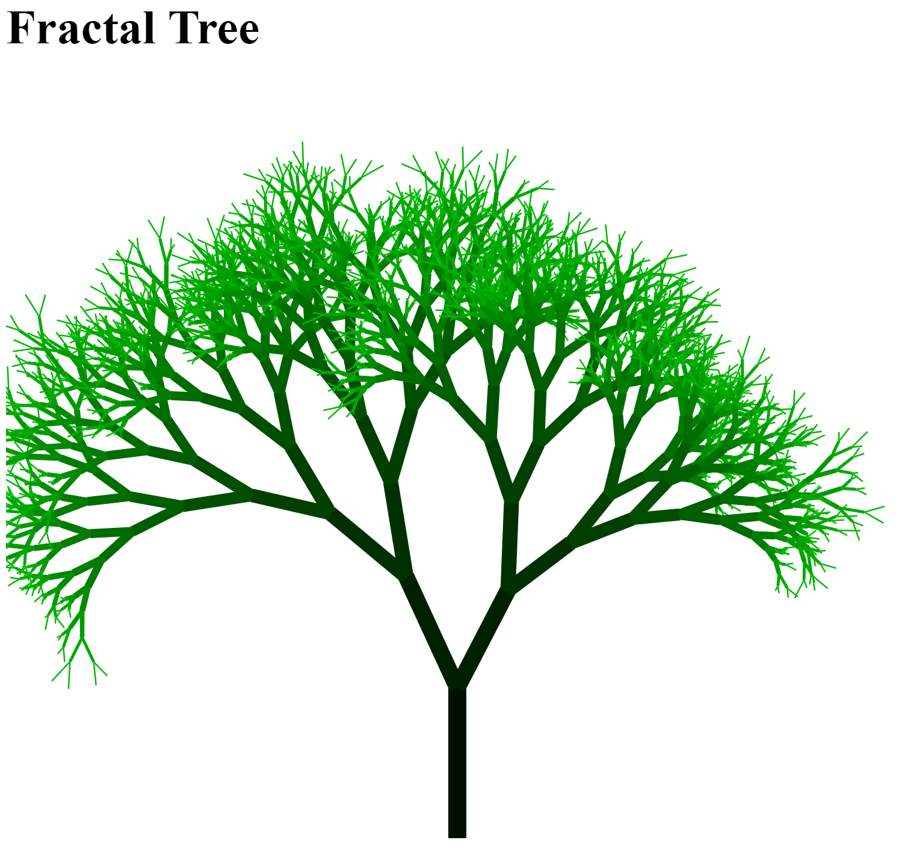

# Fractal Tree

## Introduction

In this exercise you have to implement a [Fractal Tree](https://rosettacode.org/wiki/Fractal_tree) in TypeScript.

## Requirements

* Create a very simple HTML page `index.html` that contains a [HTML5 `svg` element](https://developer.mozilla.org/en-US/docs/Web/SVG/Element/svg)
* Create a TypeScript file `app.ts`. It has to be compiled to `app.js` by TypeScript.
* Include the resulting `app.js` in the previously created HTML page.
* You have to configure the TypeScript compiler with a [*tsconfig.json*](http://www.typescriptlang.org/docs/handbook/tsconfig-json.html) file.
* You have to use [Snap.svg](http://snapsvg.io/) for drawing the tree.
* Rules for drawing the tree:
  * Start with drawing the trunk
  * At the end of the trunk, split by some angle and draw two branches
  * Repeat at the end of each branch until a sufficient level of branching is reached

## Hints

* Get *Snap.svg* and associated types (`@types/...`) from NPM.
* Take a look at [this *Snap.svg* sample](http://svg.dabbles.info/snaptut-colors) to understand how to draw colored lines.
* Use `moduleResolution` setting set to `node`.
* Use [trigonometric functions](https://en.wikipedia.org/wiki/Trigonometric_functions) *sine* and *cosine* for calculating angles.

## Advanced Exercises

* Add a random factor to angle and length changes to make the tree look more interesting.
* Use [TinyColor](https://github.com/bgrins/TinyColor) to make branches' colors a little bit lighter in each recursion (see [`lighten` function of TinyColor](https://github.com/bgrins/TinyColor#lighten)).
* Take a look at [*package.json*](package.json) and find out what the NPM packages `browser-sync` and `concurrently` do. Try to understand, integrate and use the `start` script (`npm start`) in your own solution.

## Solution

You can find a sample solution (deliberately without comments) in [*index.html*](index.html) and [*app.ts*](app.ts). However, before you take a look at it, try to find your own solution!
