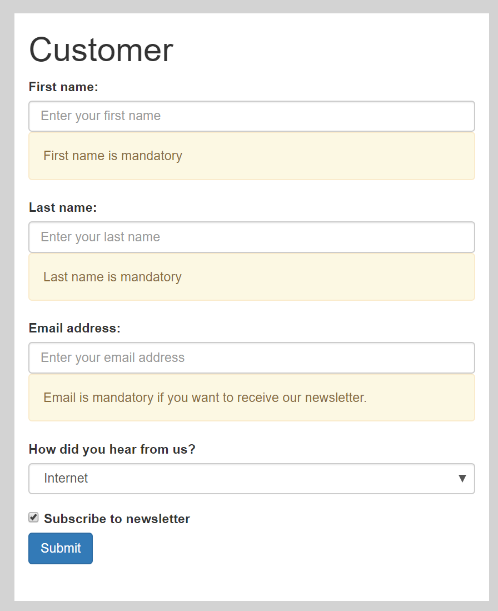

# *Form Validation* Quiz

## Introduction

In this exercise, you have to implement the validation logic for a HTML form. You will get a ready-made HTML file containing the form's view ([index.html](index.html) and [index.css](index.css)). Here is how the form looks like:

Your job is to add the necessary logic.

1. Make sure to take a close look at the scripts in *package.json*. They use some interesting tools that are helpful when doing web development.

1. Everybody has to do his/her best to come up with a solution.

1. Earn one point for your grade if you create an *GitHub Issue* in your *GitHub Classroom* containing a link to the form with validation that I can test over the Internet.

## Specification

1. You have to use *TypeScript* to write the form validation logic. *JavaScript* is **not** sufficient.

1. The message *First name is mandatory* should only be visible if the corresponding input field is empty.

1. The message *Last name is mandatory* should only be visible if the corresponding input field is empty.

1. The message *Email is mandatory if you want to receive our newsletter* should only be visible if the checkbox *Subscribe to newsletter* is set **and** the email input field is empty.

1. The text area *Please describe where you have read about us...* should only be visible if *How did you hear from us?* has the value *Other*.

1. The button *Submit* must be disabled as long as there is at least one validation error.

1. Extend the `build` script in `package.json` so that your TypeScript files are compiled when running `npm run build`.

## Hints

1. Consider using [jQuery](https://jquery.com/) for implementing the form validation. To get support for *jQuery* in TypeScript, run `npm install @types/jquery --save-dev`.

1. It is not absolutely necessary to use [jQuery](https://jquery.com/). You can also just use the browser's [DOM](https://developer.mozilla.org/en-US/docs/Web/API/Document_Object_Model/Introduction).

1. `tsconfig.json` can be created with `tsc --init`

## Extra Challenges

This exercise is boring for you because you have already done quite a bit of web development? Why not trying to implement this example using [Vue.js](https://vuejs.org/)? You could also try to bundle your solution using [webpack](https://webpack.js.org/). Note that this extra challenge is completely optional and will not be part of any exam.
