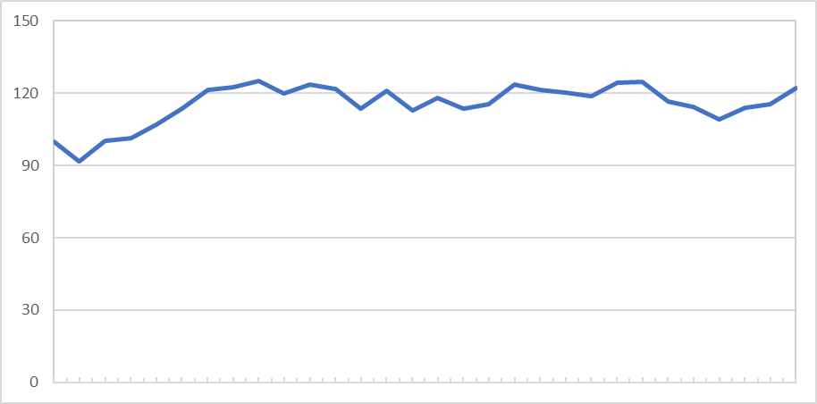

# Chart Demo

## Introduction

You probably already know the [`script` tag](https://developer.mozilla.org/en-US/docs/Web/HTML/Element/script) in HTML that loads and executes JavaScript code in *.js* files. You have used it for including your own JavaScript code and to include libraries like *jQuery*.

However, in modern web development, you do not include JavaScript code file by file. Imaging a large team consisting of dozens or hundreds of developers. They produce a lot of files. It would not make sense to include all of them separately.

To solve this problem, you use a tool for *bundling* multiple assets of your application (e.g. JavaScript, CSS) into a single or at least a few files. You only have to include those *bundles*. This makes your code smaller and faster.

One of the most wide-spread bundling solution today is [*webpack*](https://webpack.js.org/). In this exercise we will take a look at this tool. In short, it solves problems like:

* Create bundles of your code files (e.g. JavaScript, CSS)
* Compile and/or transpile source files (e.g. TypeScript)
* Optimize the bundles (e.g. minification)
* Development webserver

## Scaffolding, Abstractions

In practice, you would probably use a [scaffolding tool](https://en.wikipedia.org/wiki/Scaffold_(programming)#Project_generation) like [Yeoman](http://yeoman.io/) with an appropriate generator like [*generator-webpack-ts*](https://github.com/GaryB432/generator-webpack-ts) to scaffold the initial project files. That would save you from having to setting up everything from scratch manually.

As an alternative, you could use a more powerful web development framework like [*Angular*](https://angular.io) (we will learn about it in the second semester). Angular uses webpack in the background, you don't have to care about it.

However, in this lesson, we want to understand the concepts of webpack. Therefore, we are going to set everything up by hand to see what is going on behind the scenes.

## Setup the Application

As usual, we start our application by creating some basic configuration files. You should already understand the commands mentioned below from previous course lessons:

```txt
npm init
npm install --save-dev typescript
npx tsc --init
```

The last command creates the *tsconfig.json* file. For our example, it should look like this. Change it accordingly:

```js
{
    "compilerOptions": {
        "outDir": "./dist/",
        "module": "es6",
        "target": "es6",
        "sourceMap": true
    }
}
```

Our sample will use *jQuery*. Install it with *NPM*.

```txt
npm install jquery
```

Finally, we have to install types for TypeScript. This is necessary because we want to use Node.js and jQuery functions from our TypeScript code. If you would just use JavaScript, you could skip these commands.

```txt
npm install --save-dev @types/jquery @types/node
```

## Install *webpack*

Webpack consists of quite a few NPM packages. The main packages are *webpack* and *webpack-cli*. The development webserver is *webpack-dev-server*. However, there are lots and lots of useful plugins for webpack in NPM. In this exercise we will just use a few of them.

* *ts-loader* for compiling TypeScript when bundling our code
* *css-loader*, *style-loader*, *sass-loader*, and *node-sass* for processing and loading [SASS](https://sass-lang.com/) (similar to CSS, but much more powerful)
* *html-webpack-plugin* for injecting our bundle into our *.html* file

In practice, you will need to spend some time for research to find the appropriate plugins for your project.

```txt
npm install --save-dev webpack webpack-cli webpack-dev-server
npm install --save ts-loader css-loader style-loader sass-loader node-sass html-webpack-plugin
```

## NPM Scripts

To make our life easier, we put the most important webpack-related commands in *scripts* in our *package.json* file (you should already know about this practice from previous lessons):

```json
  ...
  "scripts": {
    "build": "webpack",
    "watch": "webpack --watch",
    "start": "webpack-dev-server"
  },
  ...
```

## webpack Configuration

Like NPM and TypeScript, webpack is also configured in a config file. Create a config file called *webpack.config.js* with the following content. In the lesson, your teacher is going to describe the meaning of the configuration settings:

```js
const path = require('path');
const HtmlWebpackPlugin = require('html-webpack-plugin');

module.exports = {
  entry: './src/index.ts',
  devtool: 'inline-source-map',
  module: {
    rules: [
      {
        test: /\.tsx?$/,
        use: 'ts-loader',
        exclude: /node_modules/
      },
      {
        test: /\.(css|sass|scss)$/,
        use: [ 'style-loader', 'css-loader', 'sass-loader' ],
        exclude: /node_modules/
      }
    ]
  },
  resolve: {
    extensions: [ '.tsx', '.ts', '.js' ]
  },
  output: {
    filename: 'bundle.js',
    path: path.resolve(__dirname, 'dist')
  },
  plugins: [
      new HtmlWebpackPlugin({
        title: 'Chart Demo',
        template: './src/index.html'
      })
  ],
  mode: 'development'
};
```

## Startup Code

Now we can start coding. To make it easier for you, I created some files to start from.

1. Create a folder called *src* in your project's root directory

1. Add all the files from [src](src) to the new folder

1. Run `npm run build` and verify that webpack correctly generates your web app in the *dist* folder. Make yourself familiar with the generated code.

1. Run `npm start` to start the development webserver

## Coding Exercise

Now it is your job. In the coding exercise, you have to create a TypeScript module that can generate line charts.

## Technical Specification

* You have to complete the reusable module [chart.ts](src/chart.ts) that can be used wherever a line chart is needed.

* The input for the line chart is a collection of numbers (see also test data below) that contains between 2 and 50 elements.

* The generated line chart can have a fixed width and height (e.g. 500px in height and 800px in width).

* The line chart has to have a X and Y axis drawn in black.
  * The Y axis has to have grid lines with values as shown in the following example. Assuming a fixed number of grid line (e.g. 10) on the Y axis is ok.
  * You have to calculate the maximum value for the Y axis based on the input data. The minimum value on the Y axis is always 0.
  * The X axis has to have tick marks as shown in the following example.



## Technical Tips

* Draw lines in SVG using `line` ([read more](https://developer.mozilla.org/en-US/docs/Web/SVG/Element/line))

* Draw paths consisting of multiple lines in SVG using `path` ([read more](https://developer.mozilla.org/en-US/docs/Web/SVG/Element/path))

* Draw text in SVG using `text` ([read more](https://developer.mozilla.org/en-US/docs/Web/SVG/Element/text))

## Test Data

Use the following test data to generate a line chart:

```js
[ 100, 91.86, 100.14, 101.23, 107.09, 113.70, 121.45, 122.71, 
125.09, 119.75, 123.65, 121.90, 113.49, 121.18, 112.96, 118.19, 
113.63, 115.61, 123.70, 121.42, 120.17, 118.65, 124.32, 124.60, 
116.53, 114.22, 109.33, 113.87, 115.41, 122.24 ]
```

## Advanced Exercises

Did you finish early? Here are some advanced exercises you could try:

* Create a second component for drawing bar charts

* Design and implement a third component for a *gauge*. Here is an example how it could look like:


