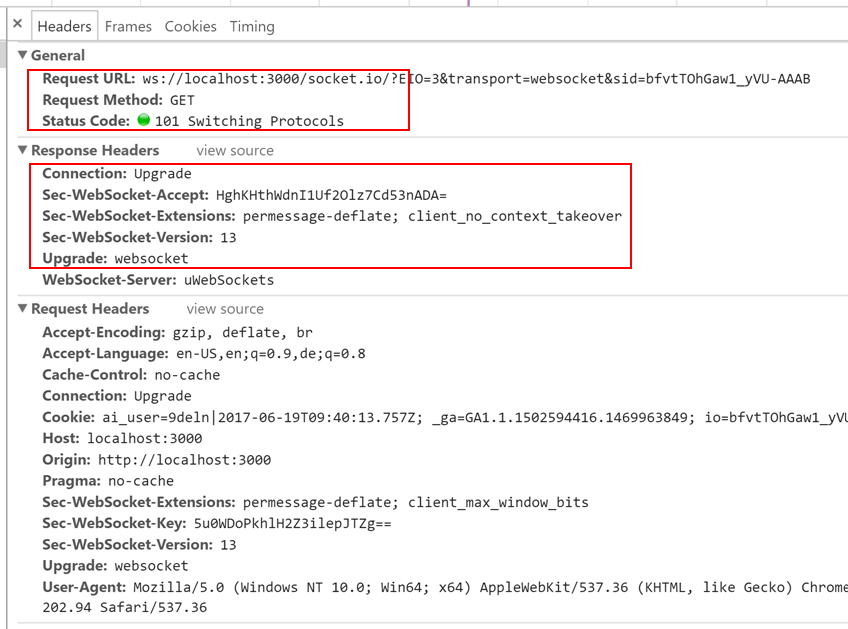
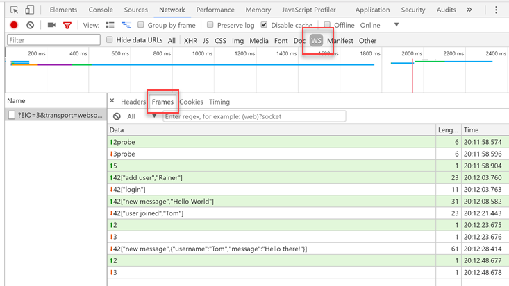

# Websockets

Introduction to [Websockets](https://en.wikipedia.org/wiki/WebSocket)


<!-- .slide: class="left" -->
## Why Websockets?

* Need for bidirectional communication between client and web server
* HTTP not designed for it
  * Two TCP connections for each client (send/receive)
  * [Long Polling](https://en.wikipedia.org/wiki/Push_technology#Long_polling)
  * High overhead
* Non-HTTP protocols do not benefit from existing infrastructure<br/>
  (e.g. proxies, filtering, authentication)


<!-- .slide: class="left" -->
## What are Websockets?

* Bidirectional communication over ports 80 or 443
* Handshake
  * Initiated with regular HTTP GET sent by client
  * Server responds with HTTP status code 101 (*Switching Protocols*)
* After successful handshake, client and server exchange *messages*
  * Text
  * Binary
* Closing handshake closes Websockets connection
* Browsers have built-in [Websockets JavaScript API](https://developer.mozilla.org/en-US/docs/Web/API/WebSockets_API)
* Many server libraries for Node.js (e.g. [Socket.io](https://socket.io), [ws](https://github.com/websockets/ws))


<!-- .slide: class="left" -->
## Initial Handshake



* Note support for debugging Websockets in browsers' dev tools


<!-- .slide: class="left" -->
## Websockets Messages



* Try it e.g. with [Websockets Echo Demo](http://demos.kaazing.com/echo/)


<!-- .slide: class="left" -->
## Programming Websockets

* Server-side
  * Node.js example libraries: [Socket.io](https://socket.io), [ws](https://github.com/websockets/ws)
  * .NET example library: [SignalR](https://github.com/aspnet/SignalR)
* Client-side
  * [Built-in Websockets API](https://developer.mozilla.org/en-US/docs/Web/API/WebSockets_API)
  * Use client-side part of server-side library (e.g. [Socket.io Client API](https://socket.io/docs/client-api/))


<!-- .slide: class="left" -->
## Simple Websockets Server with [ws](https://github.com/websockets/ws)

```
import * as WebSocket from 'ws';

// Create WebSockets server listening on port 3000
const wss = new WebSocket.Server({port: 3000});

wss.on('connection', ws => {
  // Called whenever a new client connects

  // Add handler for incoming messages
  ws.on('message', message => console.log('received: %s', message));

  // Send text message to new client
  ws.send('Welcome!');
});
```

* Try it with e.g. [Simple Websockets Client](https://github.com/hakobera/Simple-WebSocket-Client)


<!-- .slide: class="left" -->
## Broadcast with [ws](https://github.com/websockets/ws)

```
import * as WebSocket from 'ws';
import { setInterval } from 'timers';

// Create WebSockets server listening on port 3000
const wss = new WebSocket.Server({port: 3000});

function broadcast(data: string) {
  // Iterate over all clients
  wss.clients.forEach(client => {
    // Send if connection is open
    if (client.readyState === WebSocket.OPEN) client.send(data);
  });
}

let i = 0;
setInterval(() => broadcast((i++).toString()), 1000);
```


<!-- .slide: class="left" -->
## *Socket.io* Server

```
import * as express from 'express';
import * as http from 'http';
import * as sio from 'socket.io'

const app = express();
app.use(express.static(__dirname + '/public'));
const server = http.createServer(app);
server.listen(3000);

sio(server).on('connection', function(socket) {
  socket.on('message', function(message) {
    socket.emit('greet', `echo ${message}`);
  });
  socket.emit('greet', 'Welcome!');
});
```


<!-- .slide: class="left" -->
## *Socket.io* HTML

```
<!doctype html>
<html lang="de">

<head>
    <meta charset="UTF-8">
    <title>Socket IO</title>
</head>

<body>
    <script src="/socket.io/socket.io.js"></script>
    <script src="/main.js"></script>
</body>

</html>
```


<!-- .slide: class="left" -->
## *Socket.io* Client

```
declare const io: SocketIOStatic;

const socket = io();
socket.on('greet', function(message) {
  console.log(`Received: ${message}`);
});
socket.emit('message', 'Hello World!');
```


<!-- .slide: class="left" -->
## Further Readings and Exercises

* Want to know more? Read/watch...
  * [Websockets Browser API on MDN](https://developer.mozilla.org/en-US/docs/Web/API/WebSockets_API)
  * [Websockets RFC 6455](https://tools.ietf.org/html/rfc6455)
* Exercises
  * [*Chat* exercise](https://github.com/rstropek/htl-mobile-computing/blob/master/websockets/9010-chat/readme.md)
