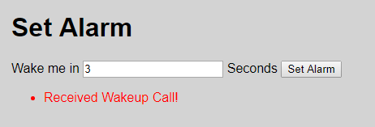

# Aufgabe 3

* Anzahl Punkte: 10
* Kalkulierte Zeit: 20 Minuten
* Anzahl Codezeilen: ca. 25

## Einleitung

Ihre Aufgabe ist die Implementierung einer Websockets-Demoanwendung **mit dem [Socket.io](https://socket.io/) Framework**.

In der Demoanwendung soll der Benutzer auf einer Webseite eingeben können, nach wievielen Sekunden er einen "Weckruf" vom Server erhalten möchte. Die Webseite soll wie folgt aussehen:



Die Webseite soll sich aus Sicht eines Benutzers wie folgt verhalten:

* Der Benutzer gibt die Anzahl an Sekunden in das Eingabefeld ein, nach denen er vom Server einen "Weckruf" erhalten möchte.
* Nach dem Klick auf *Set Alarm* beginnt die Zeit zu laufen.
* Wenn die Zeit abgelaufen ist, wird eine Meldung *Received Wakeup Call!* hinzugefügt.
* Es können gleichzeitig mehrere "Weckrufe" laufen.

Um Ihnen die Arbeit zu erleichtern, finden Sie unten den HTML-Code für die Webseite. Sie können ihn in Ihre Lösung kopieren wenn Sie möchten. **Hinweis:** Der Muster-HTML Code bindet zur Vereinfachung der Aufgabe bereits [*jQuery*](https://jquery.com/) ein. Als weitere Vereinfachung finden Sie unten ein Muster für den Inhalt der *package.json*-Datei. Sie referenziert alle Node-Packages, die Sie für die Lösung der Aufgabe benötigen.

Die Kommunikation zwischen Client (=Browser) und Server(=Node.js) muss über **Websockets** (*socket.io*) erfolgen:
  * Der Client sendet Anforderungen für "Weckrufe" an den Server über eine Websockets-Nachricht
  * Der Server sendet den "Weckruf" nach Ablauf der angegebenen Sekunden über eine Websockets-Nachricht zurück

## Anforderungen

Beachten Sie beim Lösen der Aufgabe folgende Anforderungen.

### Pflichtaufgaben (5 Punkte)

Pflichtaufgaben, die alle korrekt gelöst werden müssen, um Punkte für das Beispiel zu erhalten:

* Verwenden der Programmiersprache **JavaScript**
* Erstellen des Server-Programms (=Node.js), das mindestens folgende Funktionen korrekt implementiert:
  * Die statische Webseite wird über HTTP angeboten (über das *express* Node-Package)
  * Der *socket.io*-Websockets-Server wird gestartet
  * "Weckruf"-Anforderungen vom Client (=Browser) werden empfangen
* Erstellen des Client-seitigen Programms (=JavaScript im Browser), das mindestens folgende Funktionen korrekt implementiert:
  * *socket.io* wird eingebunden
  * Bei Klick auf *Set Alarm* wird die "Weckruf"-Anforderung an den Server über Websockets geschickt

### Optionale Aufgaben

Optionale Aufgaben, um die volle Punktzahl für das Beispiel zu erhalten:

* 2 Punkte: Server schickt nach Ablauf der angegebenen Sekunden "Weckruf" an Client via Websockets-Nachricht
* 1 Punkt: Client gibt *Received Wakeup Call!*-Nachricht aus
* 1 Punkt: Client-seitiger Code ist nicht im HTML-Code eingebettet sondern in einer eigenen JavaScript-Datei, auf die von HTML aus verwiesen wird
* 1 Punkt: Guter Programmierstil (z.B. *readme.md*, *package.json* Konfigurationsdatei, *scripts* in *package.json*, *.gitignore*, keine unnötigen Dateien eingecheckt, etc.) und effizienter Algorithmus

## HTML-Code

```
<!doctype html>
<html lang="en">

<head>
    <meta charset="UTF-8">
    <title>Server-side Wakeup Call</title>
    <style>
        body {
            font-family: sans-serif;
            margin: 20px;
            background: lightgray;
        }

        li {
            color: red;
        }
    </style>
</head>

<body>
    <h1>Set Alarm</h1>

    <p>
        <span>Wake me in</span>
        <input id="wakeInSeconds" type="number" />
        <span>Seconds</span>
        <button id="setAlarm">Set Alarm</button>
    </p>

    <ul id="alarmList" />

    <script src="https://code.jquery.com/jquery-3.2.1.min.js"></script>
    <script src="/index.js"></script>
</body>

</html>
```

## *package.json*

```
{
  "name": "exam",
  "version": "1.0.0",
  "description": "Sample for HTL course Mobile Computing",
  "main": "server.js",
  "author": "Rainer Stropek",
  "license": "MIT",
  "dependencies": {
    "express": "^4.16.2",
    "socket.io": "^2.0.4"
  }
}
```
