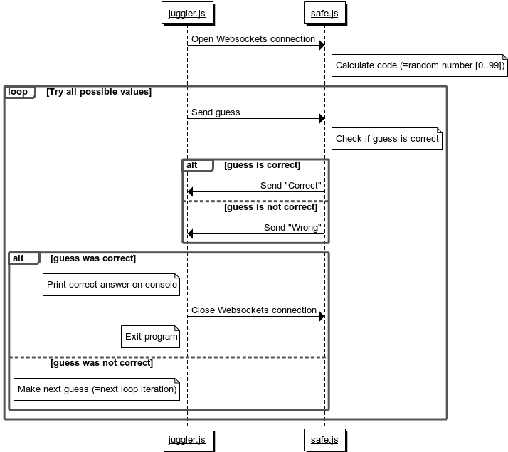

# Aufgabe 3

* Anzahl Punkte: 10
* Kalkulierte Zeit: 25 Minuten
* Anzahl Codezeilen: ca. 30

## Einleitung

Ihre Aufgabe ist die Implementierung einer Websockets-Demoanwendung **mit dem Node-Package [ws](https://www.npmjs.com/package/ws)**.

Ihre Demo-Anwendung soll aus zwei kleinen Node.js-Programmen bestehen: *safe.js* und *juggler.js*.
* *safe.js* steht für einen Tresor mit einem zufälligen, dreistelligen Code.
* *juggler.js* repräsentiert den "Safeknacker", der den Tresor knacken will, indem er alle Codes durchprobiert.

*safe.js* und *juggler.js* unterhalten sich über **Websockets**. Die folgende Abbildung zeigt den Programmablauf als Sequenzdiagramm:



**Hinweis:** Um Ihnen den Start zu erleichtern, finden Sie unten ein Muster für den Inhalt der *package.json*-Datei. Sie referenziert alle Node-Packages, die Sie für die Lösung der Aufgabe benötigen.

## Anforderungen

Beachten Sie beim Lösen der Aufgabe folgende Anforderungen.

### Pflichtaufgaben (5 Punkte)

Pflichtaufgaben, die alle korrekt gelöst werden müssen, um Punkte für das Beispiel zu erhalten:

* Verwenden der Programmiersprache **JavaScript**
* Erstellen des *safe.js*-Programms (=Node.js), das mindestens folgende Funktionen korrekt implementiert:
  * Der Websockets-Server wird gestartet
  * Für jede Websockets-Verbindung wird ein neuer, zufälliger Code erzeugt
  * Auf einen eingehenden Code wird mit *Correct* oder *Wrong* geantwortet, je nachdem, ob der Code richtig oder falsch ist
* Erstellen des *juggler.js*-Programms (=Node.js), das mindestens folgende Funktionen korrekt implementiert:
  * Websockets-Verbindung mit dem Server wird aufgebaut
  * Mögliche Codes werden einer nach dem anderen an den Server geschickt

### Optionale Aufgaben

Optionale Aufgaben, um die volle Punktzahl für das Beispiel zu erhalten:

* 2 Punkte: *juggler.js*-Programm empfängt Antwort des Servers
* 1 Punkt: *juggler.js* gibt den erratenen Code aus wenn er gefunden wurde
* 1 Punkt: *juggler.js* schließt die Websockets-Verbindung, sobald der Code erraten wurde
* 1 Punkt: Guter Programmierstil (z.B. *readme.md*, *package.json* Konfigurationsdatei, *scripts* in *package.json*, *.gitignore*, keine unnötigen Dateien eingecheckt, etc.) und effizienter Algorithmus

## *package.json*

```
{
  "name": "solution",
  "version": "1.0.0",
  "description": "",
  "main": "index.js",
  "scripts": {},
  "author": "",
  "license": "ISC",
  "dependencies": {
    "ws": "^3.3.3"
  }
}
```
