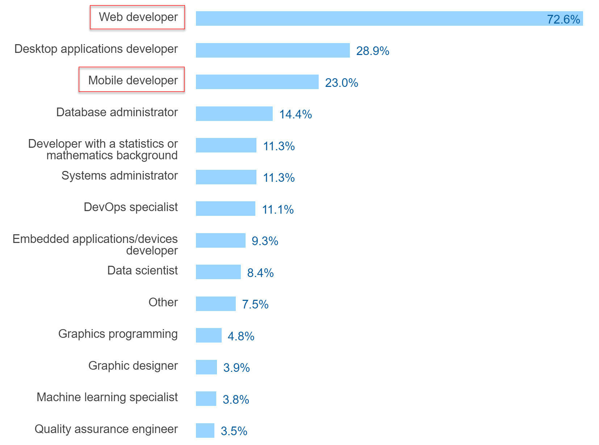

# Why?

Why bother learning web and mobile technologies?

## A Lot of Jobs

* Source: [Stackoverflow Developer Survey 2017](https://insights.stackoverflow.com/survey/2017)
* [E.g. Jobs in Linz](http://www.karriere.at/jobs/web/linz?jobFields%5B%5D=2172)

## Very Popular Programming Language

Source: [Stackoverflow Developer Survey 2017](https://insights.stackoverflow.com/survey/2017)
